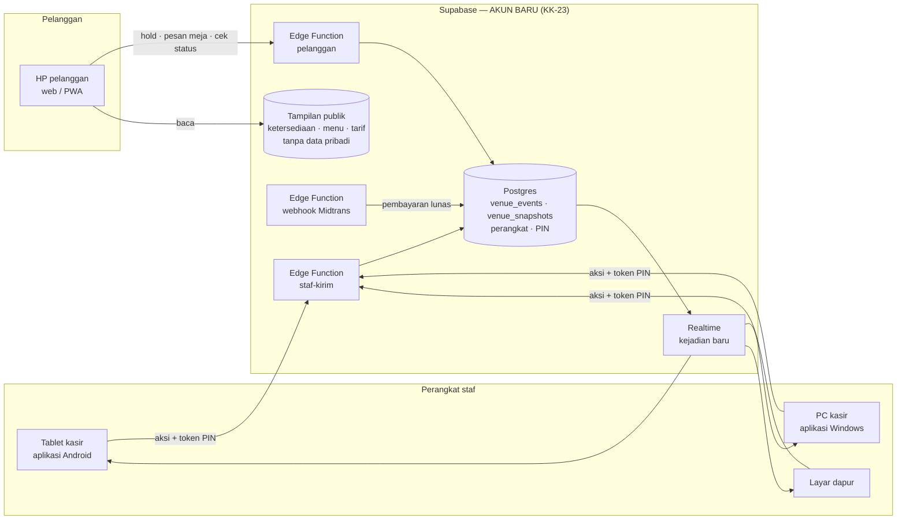

# PRD — Sinkronisasi Lintas Perangkat & Aplikasi Windows/Android

Tanggal: 15 September 2026 · Status: **draf untuk dikonfirmasi pemilik** · Melengkapi `PRD-SPL-BOOKING.md` (KK-22, KK-23, KK-24)

## 1. Tujuan

1. HP pelanggan, tablet kasir, layar dapur, dan PC Windows melihat data yang **sama dalam hitungan detik**, walau berbeda perangkat dan jaringan.
2. Staf memakai **aplikasi terpasang** di Windows dan Android (ikon sendiri, layar penuh, tanpa bilah alamat).
3. Tidak ada satu perangkat pun yang bisa merusak data bersama: tidak bisa memalsukan pelaku, jam, pembayaran, atau membuat perangkat lain crash.
4. Data pribadi tamu (nama, nomor HP) **tidak pernah dikirim ke HP pelanggan lain**.

## 2. Yang sudah siap (hasil pematangan 15 September)

| Fondasi | Kenapa penting untuk lintas perangkat | Bukti |
|---|---|---|
| Mesin tunggal & deterministik (`engine.ts`) | Semua perangkat memutar jejak yang sama dan pasti sampai pada hasil yang sama | 100 simulasi, invariant INV-32/33 (putar ulang & urutan acak identik) |
| Validasi kejadian (gagal tertutup) | Kejadian rusak dari satu perangkat tidak menjatuhkan perangkat lain | INV-43: 350 kejadian rusak disuntikkan, 0 crash, 0 perubahan data |
| Tutup buku harian otomatis | Setiap aksi tetap cepat walau sudah berbulan-bulan | Uji ketahanan 30 hari: biaya per aksi konstan, putar ulang ±1–2 dtk |
| Titik simpan (snapshot) | Perangkat baru cukup mengunduh titik simpan + kejadian sesudahnya | Uji sinkronisasi: 402 kejadian → dibuka dengan memutar 48; 8 hari = 280 KB |
| Cap dunia (genesis) & tahan siaran terlambat | Perangkat yang tertidur tidak menghidupkan data lama | Uji sinkronisasi 23/23, terbukti gagal bila pengamannya dimatikan |

Artinya server **tidak perlu menulis ulang aturan bisnis**. Server cukup menjadi *penentu urutan dan penjaga pintu* untuk jejak yang sama.

## 3. Arsitektur yang diusulkan

### 3.1 Jejak di server
- Tabel `venue_events`: `seq` (nomor urut dari server), `id` unik dari perangkat (supaya kirim ulang tidak dobel), `at` = **jam server**, `by` = karyawan dari token PIN (bukan dari isian perangkat), `act` (jsonb), `app_version`.
- Urutan resmi = `seq`. Jam perangkat yang salah tidak lagi berpengaruh ke meteran, no-show, atau hold.
- Tabel `venue_snapshots`: titik simpan per `seq`, dibuat otomatis tiap ±400 kejadian.

### 3.2 Menulis (staf)
1. Perangkat didaftarkan sekali oleh pemilik (akun perangkat). Perangkat hilang → dicabut dari panel.
2. Karyawan memasukkan PIN → server memeriksa hash PIN (percobaan dibatasi & dikunci) → token kerja 12 jam.
3. Setiap aksi dikirim ke fungsi **staf-kirim**: validasi bentuk (sama dengan `validAction`), izin peran, versi aplikasi → diberi `seq` & jam server → disimpan → disiarkan ke semua perangkat staf.
4. Layar menampilkan hasil seketika (menunggu konfirmasi), lalu memakai versi server begitu datang (±0,2–0,6 dtk).

### 3.3 Pelanggan
- HP pelanggan **tidak** mengunduh jejak venue (berisi nama & nomor HP tamu lain). Yang dibaca hanya tampilan publik: ketersediaan meja per jam, menu & stok habis, tarif.
- Aksi pelanggan lewat fungsi **pelanggan**: tahan slot (hold), batalkan hold, pesan ke meja "bayar di kasir". Harga & slot dihitung ulang di server dengan mesin yang sama (KK-24 R2).
- Pembayaran lunas **hanya** dicatat oleh webhook Midtrans di server — HP tidak bisa mengirim "sudah bayar" sendiri.
- Status pesanan dicek dengan kode pesanan (+ 4 digit akhir HP).

### 3.4 Internet putus
- Perangkat staf: banner merah setelah 10 detik terputus; aksi uang (tutup tab, void, buka meja) dikunci sampai tersambung; papan tetap bisa dibaca.
- Setelah tersambung: kejadian yang belum terkirim dikirim ulang (idempoten), lalu disinkronkan.
- Mode darurat offline penuh (antrean aksi uang) **tidak** masuk tahap ini — risikonya dobel transaksi; tetap di rencana R3.

## 4. Aplikasi Windows & Android

| Pilihan | Windows | Android | Kelebihan | Kekurangan |
|---|---|---|---|---|
| **A. PWA (rekomendasi awal)** | Pasang dari Edge/Chrome → ikon di Start | Pasang dari Chrome → ikon di layar utama | Satu build, update otomatis, tanpa toko aplikasi | Butuh alamat HTTPS (Cloudflare Pages) |
| **B. APK Android (Capacitor)** | — | Berkas APK dipasang ke tablet | Layar penuh, jalan tanpa browser, siap printer Bluetooth & mode kios | Update lewat APK baru; perlu kunci tanda tangan milik venue |
| C. Aplikasi Windows (Electron) | Installer `.exe` | — | Jalan tanpa browser | Ukuran ±150 MB, update manual |

Rekomendasi: **A untuk semua perangkat + B untuk tablet kasir**. Komputer ini sudah punya Android Studio & SDK 34/36, jadi APK bisa dibuat di sini. C hanya bila PWA Windows ternyata kurang.

## 5. Yang perlu dilakukan pemilik

Saya tidak boleh membuat akun atas nama Anda. Langkahnya ±5 menit:

1. Buat **akun Supabase baru** memakai email khusus venue — **bukan** akun `samuphotostation`.
2. Buat project: nama `spl-venue`, region **Southeast Asia (Singapore)**, password database kuat (simpan sendiri, jangan dikirim ke chat).
3. Kirim ke saya **hanya**: *Project URL* (`https://xxxx.supabase.co`) dan *anon / publishable key*.
   - **Jangan pernah** mengirim *service_role / secret key* atau password database di chat.
4. Untuk memasang skema & fungsi, pilih salah satu:
   - Tempel SQL yang saya siapkan di *SQL Editor* dashboard (paling aman, tanpa CLI); atau
   - Buat *Personal Access Token* di akun baru dan pasang hanya di terminal proyek ini (`$env:SUPABASE_ACCESS_TOKEN`) — login CLI global untuk photobooth **tidak disentuh**.
5. Nanti (tahap hosting & pembayaran): akun Cloudflare baru untuk alamat HTTPS, merchant Midtrans atas nama venue.

## 6. Tahapan

| Tahap | Isi | Butuh akun? |
|---|---|---|
| **S1** ✅ **selesai 22 Sep 2026** | Lapisan kirim kejadian dengan urutan server (`seq`), status "menunggu konfirmasi", mode terputus, tampilan publik tanpa data pribadi — diuji dengan server tiruan | Tidak |
| **S2** | Skema SQL + RLS, fungsi staf-kirim / pelanggan / titik simpan, PIN di server, uji dua perangkat nyata (PC + HP) | **Supabase baru** |
| **S3** | PWA (manifest, ikon, service worker) + APK Android kasir, uji pasang di tablet & Windows | Cloudflare baru (untuk PWA publik) |
| **S4** | Midtrans sungguhan (merujuk pola repo photobooth, hanya dibaca), sembunyikan PIN demo, pemantauan & cadangan | Merchant Midtrans |

Setiap tahap ditutup dengan tes otomatis yang sama ketatnya dengan sekarang (simulasi, uji ketahanan, uji sinkronisasi, uji mutasi) ditambah uji di perangkat nyata.

### 6.1 Hasil S1 (22 September 2026)

Yang sudah ada di dalam proyek — semuanya berjalan tanpa akun apa pun, memakai **server tiruan**:

| Berkas | Isi |
|---|---|
| `src/lib/remote.ts` | Kontrak server: `pull` / `push` / `subscribe`, bentuk kejadian ber-`seq`, dan daftar aksi uang yang dikunci saat terputus |
| `src/lib/venueStore.ts` | Mode server: antrean kirim yang tersimpan di perangkat, konfirmasi urutan server, tarik yang tertinggal, sambung ulang otomatis, dunia (genesis) mengikuti server |
| `src/lib/publicView.ts` | Potongan data yang boleh dibaca HP pelanggan — tanpa nama, nomor HP, kode booking, pesanan, atau angka uang |
| `src/screens/admin/AdminShell.tsx` | Banner "tidak tersambung" / "menunggu konfirmasi" untuk staf |
| `test/fakeServer.ts` | Server tiruan: nomor urut & jam server, pelaku dari token PIN, kirim ulang tidak dobel, validasi gagal tertutup, siaran bisa dibuat terlambat/acak |
| `test/remote.test.ts` | **39 pemeriksaan** lintas perangkat (HP, tablet, PC) — pembandingnya pemutaran ulang jejak resmi server |

Yang sudah dibuktikan tesnya: tiga perangkat berbeda berakhir identik walau siaran tiba acak; perangkat tidak bisa memalsukan pelaku (token PIN yang menentukan); jam server yang dipakai, bukan jam tablet; aksi pelayanan tetap jalan saat internet putus dan menyusul terkirim; aksi uang dikunci; antrean bertahan walau aplikasi ditutup-buka; kirim ulang tidak membuat data dobel; dua kasir merebut meja yang sama diselesaikan server; data yang direset di server diikuti perangkat; titik simpan tetap bekerja; tampilan publik tidak membocorkan data pribadi.

Yang **belum** dan menunggu akun Supabase baru: skema SQL + RLS, Edge Function staf-kirim/pelanggan, Realtime sungguhan, PIN diperiksa server, dan pendaftaran perangkat.

## 7. Risiko & mitigasi

| Risiko | Mitigasi |
|---|---|
| Supabase gratis di-pause setelah 7 hari tanpa aktivitas | Tugas pengingat harian; naik Pro saat omzet online stabil |
| Internet venue lambat (latensi ke Singapura ±40–80 ms) | Tampilan seketika + konfirmasi server; aksi uang menunggu konfirmasi |
| Tablet dicuri / dipakai orang lain | Perangkat bisa dicabut dari panel; PIN terkunci setelah salah berulang |
| Versi aplikasi lama mengirim kejadian format lama | Server menolak versi di bawah minimum; validasi gagal tertutup di semua perangkat |
| Data pribadi tamu (UU PDP) | HP pelanggan hanya membaca tampilan publik; jejak lengkap hanya untuk perangkat staf |

## 8. Keputusan yang perlu dikonfirmasi

1. Paket aplikasi staf: **PWA + APK Android kasir** (rekomendasi), atau PWA saja, atau ditambah installer Windows.
2. Saat internet putus: **aksi uang dikunci** (rekomendasi, sudah dibuat di S1 — `settle`, `closeShift`, `decideVoid`, `settleRefund`; membuka shift sengaja tidak dikunci supaya venue tetap bisa beroperasi) atau antrean offline penuh.
3. HP pelanggan: web publik dengan alamat sendiri (butuh Cloudflare baru), atau hanya lewat QR di venue dulu.
