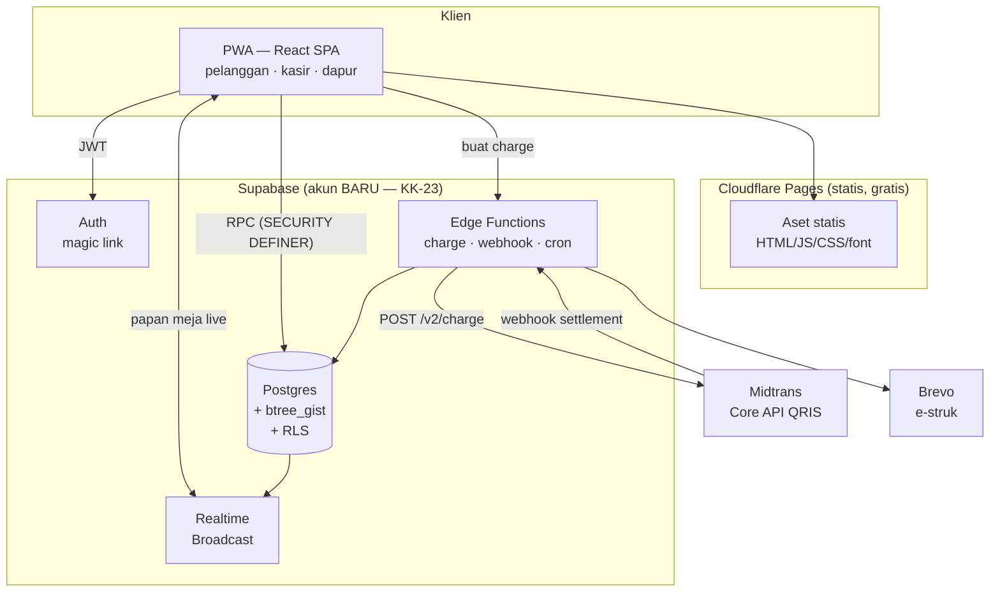

# PRD — SPL Sports Pool Lounge & Smokehouse Resto
### Aplikasi Booking Meja Biliar + Pemesanan F&B

| | |
|---|---|
| **Versi** | 1.0 — draft untuk persetujuan pemilik |
| **Tanggal** | 24 Agustus 2026 |
| **Status** | Menunggu keputusan pemilik atas 14 pertanyaan terbuka (§12) |
| **Merek** | SPL — Sports Pool Lounge (biliar) · Smokehouse Resto (F&B) |

---

## 0. Cara membaca dokumen ini

Dokumen ini adalah **satu-satunya sumber keputusan**. Ia disusun dari tujuh draft detail dan empat dokumen riset, lalu diaudit oleh tiga peninjau independen (pemilik usaha skeptis, senior engineer/security, dan kritikus kelengkapan) yang menghasilkan **85 temuan, 24 di antaranya blocker**. Semua blocker itu sudah diselesaikan dan keputusannya dicatat di **§4 Registri Keputusan Kanonik**.

Draft detailnya tetap disimpan sebagai lampiran di `docs/lampiran/` karena isinya kaya dan berguna untuk developer. Tapi lampiran itu **saling bertentangan di banyak tempat** — itulah sebabnya §4 dan §5 ada.

> **Aturan presedensi, tidak bisa ditawar:**
> **§4 Registri Keputusan Kanonik** dan **§5 Konstanta Global** mengalahkan isi lampiran mana pun.
> Kalau developer menemukan angka berbeda di lampiran, yang dipakai adalah angka di dokumen ini.

**Penanda yang dipakai:**

| Penanda | Arti |
|---|---|
| **[PERLU KONFIRMASI]** | Asumsi yang harus dijawab pemilik sebelum coding dimulai. Terkumpul di §12. |
| **ASUMSI:** | Angka yang saya tetapkan sendiri agar dokumen bisa dihitung. Boleh diganti. |
| `KK-xx` | Keputusan Kanonik — mengunci satu pilihan dari beberapa yang bertentangan |
| `AT/BK/FB/PAY/AD/FN-xx` | ID requirement per modul |
| **R1 / R2 / R3** | Rilis 1, 2, 3 — lihat §10 |

---

## 1. Ringkasan eksekutif

SPL Sports Pool Lounge dan Smokehouse Resto adalah satu venue dengan dua sub-merek: area biliar dan dapur smokehouse. Keduanya berjalan tanpa sistem transaksi. Booking masuk lewat WhatsApp, dicatat di papan tulis, dan omzet baru diketahui saat uang tunai dihitung dini hari.

Produk ini adalah **web app mobile-first (PWA)** yang memindahkan tiga transaksi inti ke satu inventaris tunggal:

1. **Booking sesi meja** dengan pembayaran QRIS di muka — slot terkunci hanya setelah uang masuk
2. **Pemesanan F&B** yang menempel ke sesi meja yang sama, satu tagihan
3. **Pencatatan walk-in oleh kasir** di sistem yang sama persis — tanpa ini, papan meja online akan selalu berbohong

Ditambah panel admin real-time, pengaturan meja & harga tanpa deploy ulang, dan dashboard keuangan yang memisahkan omzet kotor, potongan gateway, pajak, dan uang yang benar-benar masuk rekening.

**Yang membuat dokumen ini berbeda dari PRD biasa:** tiga hal paling mahal di produk semacam ini — double-booking, uang masuk tapi slot hilang, dan laporan keuangan yang menyesatkan — sudah dirancang solusinya sampai level DDL PostgreSQL dan urutan operasi webhook, bukan sekadar disebut sebagai "harus dicegah".

### Kenapa ini layak dibangun

Angka berikut memakai **data nyata dari pemilik** (34 meja: 30 reguler + 4 VIP) dan **tarif resmi dari PRICELIST BILLIARD.pdf** — bukan asumsi:

| Tarif | Nilai |
|---|---|
| Reguler 11.00–18.00 | Rp 29.000 / jam |
| Reguler 18.00–tutup | Rp 39.000 / jam |
| VIP Room | Rp 50.000 / jam |
| Paket Siang | Rp 50.000 (2 jam + 2 minuman, mulai s/d 16.00) |

Dengan jam operasional 11.00–02.00 (**15 jam**, 7 jam tarif siang + 8 jam tarif malam):

| Besaran | Perhitungan | Nilai |
|---|---|---|
| Kapasitas harian | 34 meja × 15 jam | **510 jam-meja** |
| Nilai kapasitas reguler | 30 × (7×29.000 + 8×39.000) | Rp 15.450.000 / hari |
| Nilai kapasitas VIP | 4 × 15 × 50.000 | Rp 3.000.000 / hari |
| Nilai kapasitas penuh | — | **Rp 18,45 juta / hari** |
| **Nilai 1 poin utilisasi** | 1% × Rp 18,45 juta × 30 | **± Rp 5,5 juta / bulan** |

Setiap **satu poin persentase** kenaikan utilisasi meja bernilai sekitar **Rp 5,5 juta per bulan**. Naik 10 poin bernilai ±Rp 55 juta/bulan — dua digit lebih besar daripada seluruh biaya hosting berbayar (±Rp 430.000/bulan) dan seluruh potongan MDR QRIS digabung.

Dengan 34 meja, argumennya justru makin kuat: **mengelola 34 meja dengan papan tulis praktis mustahil**. Tiap satu meja yang salah catat pada jam prime berarti Rp 39.000 hilang, dan pada skala ini kesalahan seperti itu tidak lagi sesekali.

Itulah kenapa fitur yang benar-benar penting bukan yang terlihat canggih, melainkan yang **mengisi jam kosong** (happy hour terjadwal, booking jauh hari) dan **menghentikan kebocoran** (no-show tanpa konsekuensi, cash tidak tercatat).

---

## 2. Masalah saat ini

Setiap masalah diberi ID `MS-xx` agar bisa dilacak ke requirement. Frekuensi adalah **ASUMSI** yang perlu dikoreksi pemilik.

| ID | Masalah | Kerugian |
|---|---|---|
| **MS-01** | Booking WhatsApp tidak punya sumber kebenaran — chat tenggelam, shift berikutnya tidak tahu | ±Rp 1,7 juta/bulan sesi hangus, belum termasuk pelanggan yang tidak kembali |
| **MS-02** | Papan tulis mati saat ganti shift — booking H+2 tidak tercatat sama sekali | Seluruh segmen "rencana akhir pekan" dan booking rombongan hilang. Ini justru transaksi bernilai terbesar |
| **MS-03** | Telepon masuk saat jam tersibuk | ±36 menit/malam kasir tidak melayani tamu di depannya |
| **MS-04** | Double-booking & salah catat | ±Rp 300.000/bulan kompensasi + kerusakan reputasi. Masalah yang paling dirasakan pelanggan |
| **MS-05** | Jam mati 11:00–17:00 kosong tanpa upaya terukur | ±40 jam-meja menganggur/hari. Kapasitas tidak bisa disimpan untuk besok |
| **MS-06** | Tidak tahu omzet per meja per jam | Keputusan harga diambil berdasarkan perasaan, di bisnis yang marginnya ditentukan harga. Tutup buku manual ±22 jam/bulan |
| **MS-07** | No-show tanpa konsekuensi | ±Rp 1,2 juta/bulan kapasitas hilang, terutama di jam prime |
| **MS-08** | F&B tidak menempel ke sesi meja | Attach rate tidak diketahui → tidak bisa dinaikkan. Padahal marginnya lebih tinggi dari sewa meja |
| **MS-09** | Kebocoran kas tidak terdeteksi | Tanpa struk berurut & rekonsiliasi shift, kebocoran hanya ketahuan kalau besar |

---

## 3. Persona & perjalanan pengguna

### 3.1 Persona

| Persona | Konteks | Kebutuhan utama | Frustrasi hari ini |
|---|---|---|---|
| **Reguler** (Andi, 26) | Main 2–3×/minggu, selalu meja yang sama, HP Android mid-range | Booking cepat tanpa banyak ketik, tahu meja favoritnya kosong atau tidak | Harus chat dan menunggu balasan; sering meja favorit sudah diambil |
| **Rombongan** (Dina, 31) | Ulang tahun kantor, 10 orang, butuh 2–3 meja berdekatan | Kepastian. Mau bayar di muka asal dijamin | Tidak ada yang berani menjamin lewat WA; harus datang survei dulu |
| **Kasir** (Rian, 22) | Shift 17:00–02:00, berdiri, satu tangan pegang HP/tablet | Buka sesi walk-in dalam < 10 detik, lihat semua meja sekaligus | Papan tulis, telepon, dan tamu bersamaan |
| **Pemilik** (Pak Budi) | Datang 2–3×/minggu, cek laporan dari rumah | Angka jujur: omzet, meja terlaris, jam sepi | Harus percaya catatan tangan; tidak bisa membandingkan bulan |

### 3.2 Tiga perjalanan inti

**JRN-A — Booking online dari rumah (Andi)**
Buka web → lihat papan meja Sabtu → pilih 20:00, 2 jam, Meja 3 → tambah 2 kopi & 1 wings → total tampil final (sudah termasuk pajak) → login email (magic link) → QRIS muncul dengan countdown 15:00 → bayar dari m-banking → **slot terkunci hanya setelah webhook `settlement` masuk** → e-struk + kode check-in 6 digit.

**JRN-B — Walk-in lalu pesan dari meja (tamu tanpa akun)**
Datang → kasir buka sesi walk-in di sistem (bukan di kepala) → tamu scan QR di meja → menu terbuka tanpa perlu daftar → pesan → bayar QRIS atau tandai "bayar di kasir" → tiket masuk dapur/bar.

**JRN-C — Tutup buku (Pak Budi, pagi hari)**
Buka dashboard → lihat rekap hari operasional kemarin (batas 02:00, bukan tengah malam) → omzet kotor, potongan MDR, pajak terpungut, net → per kanal (QRIS/cash/EDC) → heatmap jam-vs-hari untuk memutuskan happy hour → ekspor CSV.

---

## 4. Registri Keputusan Kanonik

Ini inti dokumen. Setiap baris menyelesaikan satu kontradiksi nyata yang ditemukan auditor. **Keputusan di sini final kecuali pemilik mengubahnya.**

### KK-01 — Kebijakan pembatalan: SATU tabel, bukan empat

Auditor menemukan **empat kebijakan berbeda** hidup bersamaan di lampiran (>4 jam, >24 jam, refund 50%, hangus total). Kebijakan pembatalan adalah **janji hukum kepada pelanggan yang sudah membayar** dan ditampilkan sebelum ia menekan bayar — tidak boleh ada dua versi.

| Waktu pembatalan sebelum sesi | Yang didapat pelanggan |
|---|---|
| **> 12 jam** | Store credit **100%** |
| **3–12 jam** | Store credit **50%** |
| **< 3 jam** | Hangus |
| **Reschedule** | Gratis 1× sampai H-3 jam, tanpa potongan |

**Tidak ada refund uang otomatis.** Alasannya bukan pelit — lihat KK-02. Store credit tidak kedaluwarsa selama akun aktif, berlaku untuk sesi meja maupun F&B.
**[PERLU KONFIRMASI]** Angka 12/3 jam dan besaran 100%/50% adalah rekomendasi saya; pemilik berhak mengubah, tapi **hanya boleh ada satu versi**.

### KK-02 — Refund QRIS: store credit, bukan pengembalian uang otomatis

Terverifikasi dari dokumentasi Midtrans:
> "Refund request is mostly applicable in Card Payment transactions"
> "Refund for other payment methods can be processed by the merchant itself, usually by transferring the money back."

Artinya refund QRIS **tidak bisa diandalkan lewat API**. Memaksakannya berarti membangun fitur yang gagal diam-diam.

**Keputusan:** MVP memakai store credit. Refund uang tunai tetap mungkin tapi sebagai **proses manual** oleh admin (transfer bank), dicatat sebagai pengeluaran dengan alasan wajib dan jejak audit.

### KK-03 — Mode tampilan harga: TAX-INCLUSIVE

Lampiran B/D/E memakai tax-inclusive, lampiran C merekomendasikan tax-exclusive. Sesi yang sama menghasilkan Rp 140.000 vs Rp 154.000 — dua angka berbeda ditagihkan ke pelanggan.

**Keputusan: TAX-INCLUSIVE.** Harga yang dilihat pelanggan adalah harga final yang dibayar. Alasannya mengikat: QRIS dibayar **di muka**, jadi angka di layar harus sama persis dengan angka di QR. Kalau exclusive, pelanggan melihat Rp 140.000 lalu ditagih Rp 154.000 — itu sengketa, bukan UX.

Perhitungan mundur (contoh PBJT 10%):
```
harga_tayang = 140.000  (yang dilihat & dibayar pelanggan)
DPP          = 140.000 / 1,10 = 127.273
PBJT         = 140.000 - 127.273 = 12.727
```
Kolom `venue_settings.price_display_mode` tetap ada agar bisa diubah, **default `inclusive`**.

### KK-04 — Anggaran waktu hold: 15 / 17 / 19 menit

Ditemukan empat nilai berbeda (8, 10, 15, 17), dan satu lampiran bertentangan dengan dirinya sendiri (`hold_duration_minutes = 15` **dan** `gateway_expiry_minutes = 15` — tabrakan di detik yang sama).

| Parameter | Nilai | Peran |
|---|---|---|
| `gateway_expiry_minutes` | **15** | `custom_expiry` yang dikirim ke Midtrans. Ini yang dilihat pelanggan sebagai countdown |
| `hold_duration_minutes` | **17** | `hold_expires_at` di database |
| `hold_grace_minutes` | **2** | Job pelepasan efektif jalan di T+19 |

**Invariant yang tidak boleh dilanggar: `gateway < DB < job`.** Kalau ketiganya sama, skenario "uang masuk, slot hilang" terjadi.

**Koreksi penting terhadap lampiran:** lampiran mengklaim *"dokumentasi Midtrans mewajibkan expiry_duration ≥ 15 menit karena batch processing"*. **Klaim itu tidak benar.** Saya cek langsung — Midtrans hanya mendokumentasikan expiry **maksimum** (QRIS/ShopeePay 5 hari, GoPay 7 hari); tidak ada minimum. Angka 15 menit adalah **pilihan produk**, dengan dasar yang memang terverifikasi:
- SLA notifikasi expiry Midtrans "up to 90s" → itulah dasar grace 2 menit
- Alur bayar QRIS nyata (buka m-banking, scan, PIN, konfirmasi) realistis 2–5 menit

Ketiga angka disimpan di tabel settings, **bukan hardcode**, agar bisa diturunkan ke 10/12/14 setelah ada data okupansi nyata.

### KK-05 — Status booking: satu enum PostgreSQL, bukan text bebas

Ditemukan empat daftar status berbeda (`seated` vs `checked_in`, `expired` vs `expired_unpaid`, `cancelled` vs `cancelled_by_user`). Akibatnya cron `expire_stale_holds()` akan gagal tiap menit dengan constraint violation — hold tidak pernah dilepas dan tidak ada yang tahu.

```sql
create type booking_status as enum (
  'hold', 'confirmed', 'checked_in', 'in_progress', 'completed',
  'cancelled_by_user', 'cancelled_by_admin', 'expired_unpaid',
  'no_show', 'paid_unfulfilled', 'refunded'
);
```

Dipakai tipe **enum**, bukan `text` + CHECK, supaya query yang menyebut nilai tak dikenal **gagal saat migrasi, bukan saat runtime jam 9 malam**.

Pemetaan istilah lama → kanonik: `seated` → `in_progress`, `expired` → `expired_unpaid`, `cancelled` → `cancelled_by_user` atau `cancelled_by_admin` (harus dipilih eksplisit).

### KK-06 — Peran pengguna: `manager`, bukan `admin`

Matriks approval anti-fraud di lampiran ditulis di atas peran `admin` yang tidak pernah didefinisikan. Policy RLS akan mengevaluasi `role='admin'` yang selalu false → owner kehilangan akses tanpa error.

```sql
create type user_role as enum ('customer','floor','kitchen','cashier','manager','owner');
```
Istilah `admin` **dihapus dari seluruh dokumen**. Kalau maksudnya "yang boleh menyetujui", itu `manager` atau `owner`.

### KK-07 — Booking rombongan multi-meja: masuk MVP, dengan `booking_group`

Lampiran menjanjikan Dina memesan 2 meja dalam satu QRIS, tapi modelnya tidak mendukung (satu baris `bookings` = satu meja, batas 2 hold/akun).

Rombongan adalah transaksi **bernilai terbesar** dan justru segmen yang paling hilang hari ini (MS-02). Kalau tidak bisa mengunci 3 meja dalam satu pembayaran, pelanggan kembali ke WhatsApp.

**Keputusan:** tambahkan entitas `booking_groups`. Satu grup = N baris `bookings`, **satu** `order_id`, hold & pembayaran **atomik**: kalau satu meja gagal exclusion constraint, seluruh grup gagal dan tidak ada uang ditarik. Batas hold dinaikkan ke **1 grup aktif berisi maksimal 4 meja** per akun.

### KK-08 — Walk-in yang belum selesai saat jam booking tiba: requirement MVP

Auditor pemilik menyebut ini "kejadian nomor satu di venue biliar, bukan kasus tepi" — dan **tidak ada satu pun aturan** untuk itu di seluruh draft. Semua jaminan anti-double-booking di level database tidak berarti kalau manusia yang menempati meja tidak bisa dipindahkan.

Requirement MVP:
1. Peringatan otomatis ke kasir **dan** ke meja walk-in pada **T-10** dan **T-3 menit**
2. **Relokasi satu-ketuk** untuk *pemesan* (bukan hanya walk-in) ke meja setara yang kosong
3. Kalau tidak ada meja setara: kompensasi terstruktur (store credit otomatis, nominal dari setting) + alasan wajib + jejak audit
4. Kasir bisa menandai "walk-in diperpanjang" yang langsung memblokir slot berikutnya agar tidak dijual online

### KK-09 — Skema harga: satu bentuk kanonik

Ada **tiga skema harga tidak kompatibel** di tiga lampiran. Seed dari satu lampiran akan langsung ditolak CHECK constraint lampiran lain.

Kanonik: tabel `pricing_rules` dengan `days_of_week smallint[]` (lebih ekspresif daripada enum `day_type`), `table_type_id` sebagai FK ke tabel `table_types` (bukan enum text), dan resolusi konflik berdasarkan `priority` lalu spesifisitas. DDL lengkap di §8.3.

Tipe meja kanonik: `regular`, `vip`, `tournament`.

### KK-10 — Exclusion constraint harus mengabaikan hold yang kedaluwarsa

Predikat di lampiran memasukkan status `hold` **tanpa** syarat `hold_expires_at > now()`. Akibatnya hold yang sudah mati tetap memblokir slot sampai cron jalan — padahal dokumen mengklaim "ketersediaan tidak bergantung pada cron". Klaim itu hanya berlaku untuk *tampilan*, tidak untuk *penulisan*.

**Keputusan:** di dalam `create_booking_hold`, **sebelum INSERT dan di transaksi yang sama**, jalankan pembersihan hold kedaluwarsa untuk meja itu. Detail SQL di §8.4. Cron tetap ada sebagai jaring pengaman, bukan sebagai mekanisme utama.

### KK-11 — Satu QR aktif per booking, bukan satu pembayaran per booking

Index unik di lampiran melarang lebih dari satu pembayaran QRIS `pending` **atau** `paid` per booking. Itu langsung mematikan fitur perpanjang sesi dan F&B tambahan — keduanya ditandai MUST.

```sql
-- SALAH (mematikan perpanjangan & F&B tambahan):
-- where status in ('pending','paid')

-- BENAR — hanya cegah dua QR menganggur bersamaan:
create unique index payments_one_pending_qris_per_booking
  on public.payments (booking_id)
  where status = 'pending' and channel = 'qris_online';
```
Idempotensi tetap dijaga oleh `unique(order_id)`.

### KK-12 — `role` dan saldo store credit TIDAK boleh berada di tabel `profiles`

Pola default Supabase adalah `create policy ... for update using (auth.uid() = id)`. Kalau `role` dan `store_credit_balance` ada di `profiles`, **pelanggan bisa menaikkan perannya sendiri menjadi owner dan menambah saldonya sendiri** lewat satu request PATCH. Ini eskalasi hak akses paling klasik di Supabase.

**Keputusan tiga lapis:**
1. `role` pindah ke tabel `user_roles` yang **tidak punya policy INSERT/UPDATE untuk `authenticated` sama sekali**
2. Store credit pindah ke ledger `store_credits` (append-only); saldo adalah **hasil SUM**, bukan kolom yang bisa ditulis
3. Policy UPDATE pada `profiles` dibatasi per-kolom (hanya `full_name`, `phone`, preferensi)

### KK-13 — Satu tabel `audit_log`, bukan dua

Dua lampiran mendefinisikan `public.audit_log` dengan skema tidak kompatibel. Migrasi kedua akan gagal `relation already exists`, atau lebih buruk: tim menjalankan salah satu dan seluruh laporan anti-fraud di lampiran lain diam-diam kosong.

Kanonik: nama kolom waktu `occurred_at`, `actor_id uuid NULL` (NULL = sistem/cron) dengan CHECK `(actor_id is not null or action like 'cron.%')`, gabungan superset kolom keduanya. DDL di §8.3.

### KK-14 — Gateway pembayaran: Midtrans saja di MVP

Pemilik menyebut "Doku atau Midtrans". Membangun keduanya menggandakan permukaan bug rekonsiliasi **tanpa menambah satu pun pelanggan yang bisa membayar** — QRIS itu interoperabel, satu QR bisa dibayar dari e-wallet dan m-banking mana pun.

**Midtrans Core API** (bukan Snap), karena halaman pembayaran harus ber-brand SPL, bukan UI putih generik gateway. Abstraksi `PaymentProvider` tetap dibuat agar Doku/Xendit bisa ditambah nanti tanpa membongkar ulang.

### KK-15 — Kitchen Display System (KDS): masuk MVP

Lampiran bertentangan (satu bilang Fase 2, satu bilang MVP dengan 20 requirement MUST).

**Keputusan: KDS masuk MVP, tapi versi paling sederhana** — satu layar daftar tiket dengan empat status dan tombol besar. Alasannya: tanpa KDS, order F&B online hanya berpindah dari "diteriakkan ke dapur" menjadi "dicetak lalu diteriakkan" — masalah MS-08 tidak selesai. Yang **tidak** masuk MVP: pemisahan tiket dapur vs bar, estimasi waktu saji, dan routing per-station. Itu Fase 2.

### KK-16 — Offline: mode darurat masuk MVP (versi termurah)

Draft menaruh offline queue di Fase 2. Tapi internet mati 1–2×/bulan adalah **kepastian**, dan saat itu kasir sama sekali tidak bisa membuka sesi walk-in. Satu malam offline = seluruh walk-in dicatat di kertas = staf belajar bahwa "sistemnya kadang tidak bisa dipakai, kertas selalu bisa". Kebiasaan itu tidak bisa dibalik.

**MVP mendapat versi paling murah**, bukan sinkronisasi dua arah:
1. RPC staf **wajib menerima** `starts_at`/`ends_at` di masa lalu dengan flag `entered_late` + alasan
2. Tombol **"Cetak Jadwal & Lembar Tally Hari Ini"** — kertas terstruktur yang kolomnya persis field yang harus diinput ulang
3. Banner merah jelas saat offline, dengan instruksi eksplisit

Sinkronisasi otomatis dua arah tetap Fase 2.

### KK-17 — Modul Autentikasi dan modul Pembayaran harus ditulis

Auditor kelengkapan menemukan bahwa **dua dari sebelas permintaan eksplisit pemilik** — login email dan pembayaran QRIS, keduanya tepat di jalur uang — hanya disebut sekilas dan tidak punya seksi fungsional, ID kanonik, maupun acceptance criteria. ID `PAY-xx` dan `WH-xx` dirujuk di banyak tempat tapi **tidak pernah didefinisikan di mana pun**.

Kedua modul ditulis di §7.1 dan §7.4 dokumen ini.

### KK-18 — Prefix ID dan registri global

Prefix kanonik, tidak boleh bertabrakan:

| Prefix | Modul | Pemilik |
|---|---|---|
| `AT-xx` | Autentikasi & akun | §7.1 |
| `BK-xx` | Booking meja | §7.2 |
| `FB-xx` | F&B & KDS | §7.3 |
| `PAY-xx` | Pembayaran & charge | §7.4 |
| `WH-xx` | Webhook & rekonsiliasi | §7.4 |
| `AD-xx` | Admin & operasional | §7.5 |
| `FN-xx` | Keuangan & laporan | §7.6 |
| `SEC-xx` | Keamanan | §8.6 |
| `R-*` | **ID milik dokumen riset** — beri prefix `R-` agar tidak tertukar | lampiran |

Rujukan ke ID riset di dalam lampiran **harus** diberi prefix `R-`.

### KK-19 — Zona waktu dan hari operasional

Semua timestamp disimpan `timestamptz`. Tampilan dan pelaporan memakai `Asia/Jakarta`. Hari operasional berakhir **02:00 WIB**, bukan tengah malam:

```sql
business_date = ((starts_at at time zone 'Asia/Jakarta') - interval '2 hours')::date
```

| `starts_at` WIB | `business_date` |
|---|---|
| 23 Agu 20:00 | 23 Agu |
| 24 Agu 00:30 | 23 Agu ← kritikal |
| 24 Agu 01:59 | 23 Agu |
| 24 Agu 02:00 | 24 Agu |

### KK-20 — Model waktu: `tstzrange` half-open, bukan slot diskrit

Sumber kebenaran adalah rentang bebas `tstzrange` per booking, dilindungi `EXCLUDE USING gist`. UI menampilkan grid 30 menit yang **disintesis saat baca**.

> **Aturan yang paling sering salah:** bound harus **half-open `'[)'`**. Dengan `'[]'`, sesi 20:00–21:00 dan 21:00–22:00 saling menolak dan venue kehilangan penjualan pada slot bersebelahan. Test yang hanya menguji overlap penuh tidak akan menangkap ini.

### KK-21 — MDR dihitung berjenjang, bukan flat

Aturan Bank Indonesia berlaku **1 Oktober 2026**:

| Kategori merchant | Bebas MDR s/d | Di atas batas |
|---|---|---|
| **Usaha Mikro (UMi)** | Rp 500.000 | 0,3% |
| Usaha Kecil/Menengah/Besar | Rp 100.000 | 0,7% |

Mayoritas booking biliar Rp 50.000–300.000. **Kalau merchant terdaftar UMi, hampir semua transaksi kena MDR 0%.** Kalau UKE, di atas Rp 100.000 kena 0,7% — pada omzet online Rp 50 juta/bulan itu Rp 350.000/bulan.

```
mdr = (gross <= mdr_free_threshold) ? 0 : round(gross * mdr_rate)
```
`merchant_category`, `mdr_free_threshold`, dan `mdr_rate` disimpan di settings — aturan BI bisa berubah lagi.

**Aksi bisnis:** cek kelayakan pendaftaran kategori **UMi** saat onboarding merchant. **[PERLU KONFIRMASI]** BI umumnya melarang membebankan MDR ke konsumen — konfirmasi ke acquirer sebelum menambahkan biaya apa pun di sisi pelanggan.

### KK-22 — Hosting: Cloudflare Pages + Supabase. Bukan Vercel Hobby, bukan GitHub Pages

Pemilik menyebut GitHub. Keduanya **melanggar ToS**, bukan sekadar kurang cocok secara teknis.

> **GitHub Pages** cannot be used *"as a free web-hosting service to run your online business, e-commerce site, or any other website that is primarily directed at either facilitating commercial transactions..."*

> **Vercel Hobby**: *"Hobby teams are restricted to non-commercial personal use only. All commercial usage of the platform requires either a Pro or Enterprise plan."* — dan definisi commercial usage mereka mencakup *"any method of requesting or processing payment from visitors of the site"*.

| Opsi | Legal untuk usaha berbayar? | Kuota |
|---|---|---|
| GitHub Pages | ❌ Tidak | — |
| Vercel Hobby | ❌ Tidak | — |
| **Cloudflare Pages/Workers** | ✅ **Ya** | 100.000 req function/**hari**, static unlimited |
| Netlify Free | ✅ Ya | 125.000 invocation/bulan |
| Supabase Free | ✅ Ya | 500 MB DB, 50k MAU, 200 realtime conn |

**Keputusan: Cloudflare Pages (SPA statis) + Supabase (Postgres, Auth, Realtime, Storage, Edge Functions).** Semua logika backend hidup di Supabase, sehingga hosting frontend cukup static — migrasi domain nanti jadi sepele.

### KK-23 — Akun infrastruktur harus BARU dan terpisah

Atas permintaan pemilik: **jangan memakai akun Supabase maupun Vercel milik `samuphotostation`.**

Ini keputusan yang tepat secara teknis, bukan hanya preferensi. Akun itu menjalankan bisnis photobooth yang **LIVE dengan Supabase Pro berbayar**. Menumpang di org yang sama berarti: project baru masuk tagihan Pro alih-alih free tier, billing dua bisnis tercampur, dan satu insiden atau suspend menjatuhkan keduanya sekaligus.

Prasyarat setup: email baru khusus venue → akun Supabase baru → akun Cloudflare baru → akun Midtrans merchant atas nama badan usaha venue.

### KK-24 — Prinsip rekayasa wajib: GAGAL TERTUTUP

Diambil dari kejadian nyata di sistem photobooth milik pemilik yang sama. Sebuah query mengambil sebagian kolom saja, sehingga satu field bernilai `undefined` dan guard menilai item custom sebagai item biasa. Akibatnya **dua sekaligus**: biaya Rp 15.000 tidak dihitung (pelanggan ditagih **Rp 1** untuk pesanan **Rp 15.001**), **dan** seluruh pemeriksaan kepemilikan terlewati.

Tiga aturan yang mengikat seluruh implementasi:

| | Aturan |
|---|---|
| **R1** | Setiap guard otorisasi/harga **gagal TERTUTUP**. Data tidak lengkap = tolak, bukan "anggap normal" |
| **R2** | Harga final **wajib** dihitung ulang di server dari baris database **lengkap**. Bukan dari input client, bukan dari `SELECT` sebagian kolom |
| **R3** | Sebelum charge dikirim ke gateway, bandingkan total server dengan total yang ditampilkan ke pelanggan. **Selisih sekecil apa pun = batalkan + alarm** |

Kalau R3 sudah ada di sistem photobooth, bug Rp 1 vs Rp 15.001 ketahuan sebelum QR terbit.

---

## 5. Konstanta Global

Satu sumber kebenaran untuk setiap angka yang muncul di lebih dari satu tempat. **Semua disimpan di tabel `venue_settings`, bukan hardcode.** Bab mana pun yang menyebut angka ini harus **merujuk**, bukan menulis ulang.

| Konstanta | Nilai default | Catatan |
|---|---|---|
| `gateway_expiry_minutes` | **15** | Countdown yang dilihat pelanggan |
| `hold_duration_minutes` | **17** | `hold_expires_at` di DB |
| `hold_grace_minutes` | **2** | Job pelepasan efektif T+19 |
| `slot_granularity_minutes` | **30** | Grid UI |
| `turnaround_minutes` | **10** | Buffer bersih-bersih & rack ulang antar sesi |
| `min_lead_time_minutes` | **60** | Booking online paling cepat; staf dikecualikan |
| `max_advance_days` | **14** | Booking paling jauh |
| `min_session_minutes` | **60** | Durasi minimum |
| `checkin_grace_minutes` | **15** | Toleransi telat sebelum ditandai no-show |
| `no_show_release_minutes` | **20** | Meja dilepas untuk dijual ulang |
| `business_day_cutoff` | **02:00 WIB** | Batas hari operasional |
| `timezone` | `Asia/Jakarta` | Simpan `timestamptz` |
| `price_display_mode` | `inclusive` | KK-03 |
| `tax_rate_pbjt` | **10%** | **[PERLU KONFIRMASI]** tarif daerah |
| `service_charge_rate` | **0%** | **[PERLU KONFIRMASI]** apakah dipungut |
| `mdr_free_threshold` | Rp 500.000 (UMi) | KK-21 |
| `mdr_rate` | 0,3% (UMi) | KK-21 |
| `cancel_full_credit_hours` | **12** | KK-01 |
| `cancel_half_credit_hours` | **3** | KK-01 |
| `max_tables_per_group` | **4** | KK-07 |
| `max_active_groups_per_account` | **1** | Anti-abuse |
| `webhook_response_deadline` | **< 5 detik** | Syarat Midtrans |
| `status_poll_throttle_seconds` | **10** | Fallback polling |
| `relocation_warning_minutes` | **10 dan 3** | KK-08 |

---

## 6. Ruang lingkup — MVP Cut Line

Draft detail menghasilkan **355 requirement**, dengan seksi booking saja menandai **118 item sebagai "Must"**. Itu bukan MVP, itu roadmap dua tahun. Kalau daftar itu diserahkan apa adanya ke developer, aplikasi tidak akan pernah rilis dan pemilik kehilangan momentum.

### 6.1 Kriteria masuk MVP

Sebuah requirement masuk R1 **hanya jika** tanpanya venue tidak bisa melakukan salah satu dari tiga hal ini:

| | Kriteria |
|---|---|
| **(a)** | **Menerima uang** dengan benar |
| **(b)** | **Mencegah double-booking** |
| **(c)** | **Menutup buku harian** dengan angka yang jujur |

Semua yang lain turun ke R2/R3. Tidak dihapus — hanya tidak menghalangi rilis.

### 6.2 Tiga rilis

| Rilis | Target | Isi |
|---|---|---|
| **R1 — Bisa jualan** | ≤ 6 minggu | Booking 1 meja + QRIS + anti-double-booking + walk-in di sistem + papan meja realtime + tutup tab cash/EDC + rekap harian + login email |
| **R2 — Bisa dikelola** | +4 minggu | F&B lengkap + KDS + booking rombongan + store credit + dashboard keuangan penuh + heatmap + ekspor |
| **R3 — Bisa tumbuh** | +6 minggu | Loyalty, voucher, happy hour otomatis, offline sync dua arah, integrasi WhatsApp, laporan pajak |

> **[PERLU KONFIRMASI]** Estimasi ini mengasumsikan **satu developer full-stack penuh waktu** yang sudah familiar dengan Supabase. Dengan developer paruh waktu, kalikan sekitar 2,5 kali.

### 6.3 Tabel IN / OUT / NANTI

| Kapabilitas | R1 | R2 | R3 | Alasan penempatan |
|---|:--:|:--:|:--:|---|
| Login email (magic link) | ✅ | | | Syarat menerima uang atas nama seseorang |
| Booking 1 meja + QRIS | ✅ | | | Inti produk |
| Anti double-booking (exclusion constraint) | ✅ | | | Kriteria (b) |
| Papan meja realtime | ✅ | | | Permintaan eksplisit pemilik |
| Walk-in dicatat kasir | ✅ | | | Tanpa ini papan meja berbohong |
| Relokasi & peringatan T-10/T-3 (KK-08) | ✅ | | | Kejadian nomor satu di lantai |
| Cash/EDC masuk ledger | ✅ | | | Kriteria (c) — tanpa ini laporan menyesatkan |
| Rekap harian + ekspor CSV | ✅ | | | Kriteria (c) |
| Kelola meja & harga | ✅ | | | Permintaan eksplisit pemilik |
| Mode darurat offline (cetak tally) | ✅ | | | KK-16 |
| Audit log | ✅ | | | Anti-fraud sejak hari pertama |
| F&B pesan dari meja (scan QR) | | ✅ | | Butuh menu dan foto disiapkan dulu |
| KDS sederhana | | ✅ | | KK-15 |
| Booking rombongan multi-meja | | ✅ | | KK-07 — bernilai besar tapi kompleks |
| Store credit & pembatalan | | ✅ | | Butuh ledger dulu |
| Dashboard keuangan + heatmap | | ✅ | | Butuh data terkumpul dulu |
| Perpanjang sesi via QRIS | | ✅ | | |
| Loyalty / membership | | | ✅ | |
| Voucher & happy hour otomatis | | | ✅ | |
| Offline sync dua arah | | | ✅ | |
| Notifikasi WhatsApp | | | ✅ | |
| Integrasi lampu meja (relay) | | | ✅ | Butuh perangkat keras |
| **Aplikasi native iOS/Android** | ❌ | ❌ | ❌ | PWA cukup; native menggandakan biaya tanpa manfaat di sini |
| **Multi-cabang** | ❌ | ❌ | ❌ | Satu venue dulu. Skema tetap menyisakan `venue_id` |

### 6.4 Aturan scope

**Satu masuk, satu keluar.** Setelah pemilik menyetujui isi R1, penambahan fitur ke R1 harus disertai pengeluaran fitur lain dengan bobot setara. Ini satu-satunya cara PRD tetap berarti setelah minggu ketiga.

---

## 7. Spesifikasi fungsional

Bab ini memuat **modul yang belum pernah ditulis** (Autentikasi dan Pembayaran, lihat KK-17) secara lengkap, dan untuk modul lain memuat keputusan tingkat atas plus rujukan ke lampiran detail.

### 7.1 Autentikasi & Akun (AT-xx)

Salah satu dari sebelas permintaan eksplisit pemilik, tapi tidak pernah punya seksi sendiri.

**Keputusan: magic link, bukan OTP SMS, bukan password.**
Alasan: tanpa password berarti tidak ada password yang bocor atau dilupakan; magic link lewat email gratis lewat Supabase Auth, sedangkan OTP SMS berbiaya per pesan dan butuh vendor tambahan. Nomor HP tetap dikumpulkan (wajib untuk dihubungi kasir) tapi **tidak** dipakai sebagai kredensial di MVP.

| ID | Requirement | Prioritas | Rilis |
|---|---|---|---|
| AT-01 | Pelanggan mendaftar/masuk dengan email via magic link. Tidak ada password | Must | R1 |
| AT-02 | Magic link berlaku **15 menit**, sekali pakai | Must | R1 |
| AT-03 | Saat pertama masuk, wajib melengkapi **nama** dan **nomor HP** sebelum bisa booking | Must | R1 |
| AT-04 | Nomor HP divalidasi format Indonesia (+62 atau 08), disimpan ternormalisasi ke +62 | Must | R1 |
| AT-05 | **Guest checkout untuk F&B saja** (scan QR di meja): boleh pesan tanpa akun, cukup nama dan nomor meja. Booking meja **wajib** akun | Must | R2 |
| AT-06 | Sesi pelanggan bertahan **30 hari**; sesi staf **12 jam**; sesi owner **7 hari** | Must | R1 |
| AT-07 | Perangkat kasir minta **PIN 4 digit** untuk membuka kembali setelah 5 menit idle — mencegah tamu memakai tablet yang ditinggal | Must | R1 |
| AT-08 | Perangkat kasir **tidak pernah** otomatis login sebagai `owner` | Must | R1 |
| AT-09 | Staf dibuat oleh `owner` atau `manager` lewat undangan email; tidak ada pendaftaran mandiri untuk peran staf | Must | R1 |
| AT-10 | Rate limit permintaan magic link: **5 per email per jam**, **20 per IP per jam** | Must | R1 |
| AT-11 | Pelanggan bisa menghapus akun; data transaksi dianonimkan (bukan dihapus) demi integritas laporan keuangan | Should | R2 |
| AT-12 | Persetujuan pemasaran **terpisah** dari persetujuan layanan, **opt-in**, tidak tercentang default | Must | R1 |

**Acceptance criteria**

```
AC-AT-01
  Given  pengunjung belum punya akun
  When   ia memasukkan email valid dan menekan "Kirim tautan masuk"
  Then   email terkirim di bawah 30 detik, berisi tautan sekali pakai berlaku 15 menit
  And    tautan yang sudah dipakai atau kedaluwarsa menampilkan halaman
         "Tautan tidak berlaku lagi" dengan tombol kirim ulang — bukan error mentah

AC-AT-03
  Given  pengguna baru saja masuk pertama kali dan belum mengisi nama/HP
  When   ia mencoba membuka halaman checkout booking
  Then   ia dialihkan ke form lengkapi profil
  And    keranjangnya TIDAK hilang setelah profil disimpan

AC-AT-07
  Given  tablet kasir tidak disentuh selama 5 menit
  When   seseorang menyentuh layar
  Then   muncul kunci PIN 4 digit
  And    data di layar tertutup, bukan hanya ditimpa overlay transparan
```

### 7.2 Booking meja (BK-xx)

Detail lengkap ada di [lampiran/L2-booking-engine.md](lampiran/L2-booking-engine.md) — kualitasnya baik dan bisa dipakai langsung, **dengan koreksi**: semua angka waktu mengikuti §5, semua status mengikuti KK-05, kebijakan pembatalan mengikuti KK-01.

**Keputusan tingkat atas:**

| Aspek | Keputusan | Ref |
|---|---|---|
| Model waktu | `tstzrange` half-open, grid UI 30 menit disintesis saat baca | KK-20 |
| Anti-overlap | `EXCLUDE USING gist` plus pembersihan hold kedaluwarsa dalam transaksi yang sama | KK-10 |
| Hold pembayaran | 15 / 17 / 19 menit | KK-04 |
| Harga terkunci | Snapshot harga disimpan di baris booking saat hold dibuat. Perubahan harga oleh admin **tidak pernah** mengubah booking yang sudah ada | — |
| Rombongan | `booking_groups`, atomik | KK-07 |
| Walk-in bentrok | Peringatan T-10 dan T-3, relokasi satu-ketuk | KK-08 |
| Pembatalan | Store credit berjenjang | KK-01 |

**State machine** (transisi yang diizinkan):

```
                    ┌─ expired_unpaid ← (job T+19, hold tak dibayar)
                    │
  [buat] → hold ────┼─ cancelled_by_user  (pelanggan batal sebelum bayar)
                    │
                    └─ confirmed ─┬─ checked_in → in_progress → completed
                       (webhook   │
                        settlement)├─ cancelled_by_user   (KK-01: store credit)
                                  ├─ cancelled_by_admin  (alasan wajib + audit)
                                  ├─ no_show             (job, T+15 grace)
                                  └─ refunded            (manual owner)

  paid_unfulfilled ← kasus khusus: pembayaran masuk tapi slot sudah tidak tersedia.
                     Otomatis jadi store credit dan memicu alarm. TIDAK PERNAH senyap.
```

| Dari | Ke | Pemicu | Efek samping |
|---|---|---|---|
| `hold` | `confirmed` | Webhook `settlement` terverifikasi | Ledger PAID, e-struk, kode check-in, broadcast realtime |
| `hold` | `expired_unpaid` | Job T+19 | Slot dilepas, broadcast |
| `hold` | `paid_unfulfilled` | Webhook masuk **setelah** slot diambil orang lain | Store credit penuh otomatis dan alarm prioritas tinggi |
| `confirmed` | `checked_in` | Kasir atau pelanggan scan kode 6 digit | — |
| `checked_in` | `in_progress` | Jam mulai tercapai | Timer meja jalan |
| `in_progress` | `completed` | Kasir tutup tab | Tagihan final, ledger |
| `confirmed` | `no_show` | Job, T+15 setelah `starts_at` tanpa check-in | Meja dilepas T+20, sesi hangus sesuai KK-01 |

### 7.3 Pemesanan F&B (FB-xx)

Detail di [lampiran/L3-fnb-ordering.md](lampiran/L3-fnb-ordering.md), dengan koreksi **KK-03 (tax-inclusive)** — seluruh contoh perhitungan di lampiran itu ditulis exclusive dan **harus diabaikan**.

Tiga mode yang didukung:

| Mode | Kapan | Pembayaran |
|---|---|---|
| **Menempel booking** | Ditambahkan saat checkout booking online | Satu QRIS, satu total |
| **Scan QR di meja** | Tamu sudah di lokasi (walk-in maupun booking) | QRIS sendiri, atau tandai "bayar di kasir" |
| **Takeaway** | Tanpa meja | QRIS di muka |

KDS masuk MVP dalam bentuk paling sederhana (KK-15): satu layar, empat status (BARU, DIPROSES, SIAP, SELESAI), tombol besar, notifikasi suara saat tiket baru masuk.

### 7.4 Pembayaran (PAY-xx dan WH-xx)

Modul ini **tidak pernah ada** di draft mana pun meskipun ID-nya dirujuk di lima tempat (KK-17). Ditulis lengkap di sini karena ini jalur uang.

#### 7.4.1 Membuat charge

| ID | Requirement | Prioritas |
|---|---|---|
| PAY-01 | Charge dibuat **hanya di server** (Supabase Edge Function). Server Key tidak pernah dikirim ke client | Must |
| PAY-02 | Total **dihitung ulang di server** dari baris DB lengkap. Angka dari client hanya usulan (KK-24 R2) | Must |
| PAY-03 | Sebelum charge dikirim, bandingkan total server dengan total yang ditampilkan client. Selisih berarti batalkan dan alarm (KK-24 R3) | Must |
| PAY-04 | `order_id` berformat `SPL-{booking_code}-{attempt}`, unik, disimpan sebagai `payments.order_id UNIQUE` | Must |
| PAY-05 | Body charge: `payment_type: "qris"`, `qris: { acquirer: "gopay" }`, `custom_expiry` sebesar `gateway_expiry_minutes` | Must |
| PAY-06 | Ambil QR dari `qr_string`; fallback ke `actions[].url` dengan `name === "generate-qr-code"`. Kalau dua-duanya kosong, gagal terkendali dan hold dilepas segera | Must |
| PAY-07 | Environment dideteksi otomatis dari prefix Server Key: `SB-Mid-` berarti sandbox, `Mid-` berarti production | Must |
| PAY-08 | Satu QR aktif per booking (KK-11) | Must |
| PAY-09 | Kalau Midtrans gagal total, hold **dilepas segera** — tidak menunggu 17 menit | Must |
| PAY-10 | Sesi bernilai Rp 0 (tertutup penuh store credit) **tidak** memanggil gateway; langsung `confirmed` dan tetap dicatat di ledger | Must |
| PAY-11 | Endpoint daftar metode pembayaran hanya mengembalikan boolean ketersediaan, tidak pernah mengirim key | Must |

> **PAY-07 hemat berjam-jam debug.** Ini diambil dari sistem photobooth pemilik, di mana komentar kodenya menyebut mekanisme ini mencegah error `Unknown Merchant server_key/id` — yaitu ketika key production dikirim ke endpoint sandbox atau sebaliknya.

#### 7.4.2 Webhook (WH-xx)

| ID | Requirement | Prioritas |
|---|---|---|
| WH-01 | Verifikasi signature `SHA512(order_id + status_code + gross_amount + ServerKey)` **sebelum menyentuh database** | Must |
| WH-02 | **Signature gagal berarti HTTP 401 dan berhenti. Tidak ada fallback, tidak ada pengecualian** | Must |
| WH-03 | Raw body disimpan mentah untuk perhitungan digest. Jangan hitung dari body yang sudah di-parse framework | Must |
| WH-04 | Setiap notifikasi disimpan ke `payment_events` (append-only) **sebelum** diproses | Must |
| WH-05 | Balas **HTTP 200 dalam kurang dari 5 detik**. Pemrosesan berat dilakukan setelah membalas | Must |
| WH-06 | Order tidak dikenal tetap dibalas **200** setelah dicatat, bukan 404. Non-2xx memicu badai retry dari gateway | Must |
| WH-07 | Idempoten: kalau transaksi sudah `paid`, notifikasi ulang tidak mengubah apa pun dan tidak mencatat pendapatan dua kali | Must |
| WH-08 | Status tidak boleh turun: yang sudah `paid` tidak bisa dijadikan `expired` atau `failed` oleh notifikasi telat | Must |
| WH-09 | Pemetaan status: `settlement` menjadi PAID. `capture` dengan `accept` menjadi PAID, `challenge` menjadi PENDING, `deny` menjadi FAILED. `expire` menjadi EXPIRED. `deny`, `cancel`, `failure` menjadi FAILED | Must |
| WH-10 | Kalau webhook `settlement` tiba tapi slot sudah tidak tersedia, booking menjadi `paid_unfulfilled` dengan store credit otomatis dan alarm | Must |
| WH-11 | Polling fallback `GET /v2/{order_id}/status`, throttle 10 detik, dipicu dari halaman tunggu pelanggan | Must |
| WH-12 | Alert kalau ada `payment_events` yang gagal diproses. **Kegagalan webhook tidak boleh senyap — ini uang** | Must |

> ⚠️ **WH-02 adalah pelajaran langsung dari sistem photobooth pemilik.** Di sana, jalur webhook DOKU memiliki "resilient fallback": ketika verifikasi signature gagal, kode tetap menerima transaksi asalkan header `client-id` cocok, lalu menandainya lunas. **`Client-Id` bukan rahasia** — ia header biasa yang dikirim di setiap request. Siapa pun yang tahu Client-Id dan sebuah nomor invoice bisa memalsukan pembayaran. Kalau signature sering gagal karena body sudah di-parse framework, obatnya adalah WH-03 (simpan raw body), **bukan** melewati pemeriksaannya.

#### 7.4.3 Urutan aman saat webhook tiba

```
1. Terima POST
2. Hitung SHA512 dari RAW body, bandingkan dengan signature_key
   ├─ tidak cocok → INSERT payment_events(verified=false) → balas 401 → STOP
   └─ cocok → lanjut
3. INSERT payment_events(verified=true, payload utuh)   ← append-only, sebelum apa pun
4. Balas HTTP 200                                        ← dalam < 5 detik
5. (async) SELECT payment FOR UPDATE WHERE order_id = ?
   ├─ tidak ada     → catat anomali dan alarm, selesai (sudah balas 200)
   ├─ sudah 'paid'  → selesai (idempoten, WH-07)
   └─ 'pending'     → lanjut
6. Map status (WH-09)
7. Kalau PAID:
   a. Cek apakah slot masih milik booking ini
      ├─ ya    → UPDATE booking ke 'confirmed', ledger PAID, broadcast, kirim e-struk
      └─ tidak → UPDATE booking ke 'paid_unfulfilled'
                 + INSERT store_credits senilai penuh
                 + alarm prioritas tinggi ke owner
   b. Semua dalam SATU transaksi
8. Kalau EXPIRED atau FAILED dan status belum 'paid' → update, lepas slot, broadcast
```

**Kenapa langkah 7a ada:** inilah skenario "uang masuk, slot hilang" — kejadian paling mahal di produk booking berbayar. Tanpa cabang eksplisit ini, pelanggan sudah membayar tapi tidak punya meja dan tidak punya uangnya kembali.

#### 7.4.4 Pembayaran non-online

| ID | Requirement | Prioritas |
|---|---|---|
| PAY-20 | Kasir mencatat pembayaran **cash** dan **EDC** di sistem. Tetap masuk ledger sebagai transaksi lunas dengan `channel` berbeda | Must |
| PAY-21 | Tanpa PAY-20, dashboard keuangan hanya menampilkan sebagian uang dan **menyesatkan pemilik** | Must |
| PAY-22 | Setiap pembayaran manual mencatat siapa kasirnya, shift mana, dan waktunya | Must |
| PAY-23 | Void atau koreksi butuh alasan wajib dan approval `manager` atau `owner`, tercatat di `audit_log` | Must |

### 7.5 Admin & operasional (AD-xx)

Detail di [lampiran/L4-admin-operasional.md](lampiran/L4-admin-operasional.md), dengan koreksi **KK-06**: peran `admin` di lampiran itu harus dibaca sebagai `manager`.

**Matriks peran (kanonik):**

| Kapabilitas | customer | floor | kitchen | cashier | manager | owner |
|---|:--:|:--:|:--:|:--:|:--:|:--:|
| Lihat papan meja | sebagian | ✅ | | ✅ | ✅ | ✅ |
| Buka sesi walk-in | | ✅ | | ✅ | ✅ | ✅ |
| Check-in / tutup tab | | ✅ | | ✅ | ✅ | ✅ |
| Lihat tiket dapur | | | ✅ | | ✅ | ✅ |
| Catat cash / EDC | | | | ✅ | ✅ | ✅ |
| Beri diskon manual | | | | | ✅ | ✅ |
| Void transaksi | | | | | ✅ | ✅ |
| **Ubah harga** | | | | ❌ | ✅ | ✅ |
| **Kelola meja** | | | | ❌ | ✅ | ✅ |
| Kelola menu & sold-out | | ✅ | ✅ | ✅ | ✅ | ✅ |
| **Lihat laporan keuangan penuh** | | | | ❌ | ✅ | ✅ |
| Kelola staf & peran | | | | | | ✅ |
| Lihat audit log | | | | | ✅ | ✅ |

Dua baris yang ditandai ❌ pada `cashier` adalah kontrol anti-fraud paling penting: **kasir tidak boleh mengubah harga dan tidak boleh melihat omzet penuh.**

### 7.6 Keuangan & laporan (FN-xx)

Detail di [lampiran/L5-keuangan-dan-laporan.md](lampiran/L5-keuangan-dan-laporan.md).

**Prinsip yang tidak boleh dilanggar** — lima angka ini wajib dipisahkan, dan mencampurnya adalah kesalahan yang membuat pemilik salah baca untung:

| Lapisan | Arti |
|---|---|
| **Gross** | Yang dibayar pelanggan |
| **Pajak terpungut (PBJT)** | Bukan pendapatan. Uang titipan untuk pemerintah daerah |
| **Service charge** | Kalau dipungut, punya perlakuan sendiri |
| **Potongan MDR** | Biaya gateway, dihitung berjenjang (KK-21) |
| **Net settlement** | Yang benar-benar masuk rekening |

Rumus utilisasi harus hati-hati pada penyebutnya:
```
utilisasi = jam-meja terjual / (jumlah meja aktif × jam operasional)
```
Bukan dibagi 24 jam, dan meja berstatus maintenance dikeluarkan dari penyebut.

---

## 8. Arsitektur teknis

Bagian §8.1–§8.6 ditulis khusus untuk dokumen ini karena draft aslinya terpotong dan kehilangan seluruh bab arsitektur, DDL, RPC, integrasi Midtrans, dan RLS. Bagian realtime, cron, observability, backup, dan estimasi biaya yang selamat ada di [lampiran/L6-teknis-realtime-cron-backup.md](lampiran/L6-teknis-realtime-cron-backup.md).

### 8.1 Stack

| Lapisan | Pilihan | Alasan |
|---|---|---|
| Frontend | **React + Vite + TypeScript**, PWA | SPA statis; bisa di-host di mana saja, migrasi host jadi sepele |
| Styling | **Tailwind CSS** dengan token merek | Cepat, dan token memaksa konsistensi warna |
| Animasi | **framer-motion** | Sudah terpasang di proyek |
| Hosting frontend | **Cloudflare Pages** | Legal untuk komersial, 100k req function/hari, static unlimited (KK-22) |
| Database | **Supabase Postgres** | Butuh `btree_gist` untuk exclusion constraint — ini alasan teknis memilih Postgres, bukan preferensi |
| Auth | **Supabase Auth** (magic link) | Gratis, tanpa password (KK-17, §7.1) |
| Realtime | **Supabase Realtime Broadcast** | Papan meja live |
| Backend logic | **Supabase Edge Functions** (Deno) | Webhook Midtrans, charge, cron |
| Email | **Brevo** atau SMTP Supabase | E-struk & magic link |
| Gateway | **Midtrans Core API QRIS** | KK-14 |

**Semua logika berbayar hidup di Supabase**, bukan di hosting frontend. Konsekuensinya bagus: frontend cuma berkas statis, jadi pindah dari Cloudflare ke mana pun tidak menyentuh backend sama sekali.

### 8.2 Diagram



**Aturan yang tidak boleh dilanggar:** client **tidak pernah** menulis langsung ke tabel `bookings`, `payments`, atau `store_credits`. Semua penulisan lewat RPC `SECURITY DEFINER` yang menghitung ulang harga di server (KK-24 R2).

### 8.3 Skema database

```sql
-- ══════════════════════════════════════════════════════════
-- 00_extensions.sql
-- ══════════════════════════════════════════════════════════
create extension if not exists btree_gist;   -- WAJIB untuk exclusion constraint
create extension if not exists pgcrypto;

-- ══════════════════════════════════════════════════════════
-- 01_types.sql   (KK-05, KK-06)
-- ══════════════════════════════════════════════════════════
create type booking_status as enum (
  'hold','confirmed','checked_in','in_progress','completed',
  'cancelled_by_user','cancelled_by_admin','expired_unpaid',
  'no_show','paid_unfulfilled','refunded'
);

create type user_role as enum ('customer','floor','kitchen','cashier','manager','owner');

create type payment_status  as enum ('pending','paid','expired','failed','refunded');
create type payment_channel as enum ('qris_online','cash','edc','store_credit','comp');
create type booking_source  as enum ('online','walk_in','phone','admin');
create type order_status    as enum ('new','preparing','ready','served','cancelled');

-- ══════════════════════════════════════════════════════════
-- 02_identity.sql   (KK-12 — role & saldo TIDAK di profiles)
-- ══════════════════════════════════════════════════════════
create table public.profiles (
  id                  uuid primary key references auth.users(id) on delete cascade,
  full_name           text not null check (length(trim(full_name)) between 2 and 80),
  phone               text check (phone ~ '^\+62[0-9]{8,13}$'),
  is_blacklisted      boolean not null default false,
  blacklist_reason    text,
  internal_note       text,
  consent_tos_at      timestamptz,
  consent_privacy_at  timestamptz,
  consent_marketing_at timestamptz,
  created_at          timestamptz not null default now(),
  updated_at          timestamptz not null default now()
);

-- Tabel terpisah. TIDAK ADA policy INSERT/UPDATE untuk peran `authenticated`.
-- Inilah yang mencegah pelanggan menaikkan dirinya sendiri jadi owner.
create table public.user_roles (
  user_id    uuid primary key references public.profiles(id) on delete cascade,
  role       user_role not null default 'customer',
  granted_by uuid references public.profiles(id),
  granted_at timestamptz not null default now()
);

create or replace function public.current_role()
returns user_role language sql stable security definer set search_path = public as $$
  select coalesce((select role from public.user_roles where user_id = auth.uid()), 'customer')
$$;

create or replace function public.is_staff() returns boolean
language sql stable as $$
  select public.current_role() in ('floor','kitchen','cashier','manager','owner')
$$;

create or replace function public.is_manager() returns boolean
language sql stable as $$
  select public.current_role() in ('manager','owner')
$$;

-- ══════════════════════════════════════════════════════════
-- 03_venue.sql
-- ══════════════════════════════════════════════════════════
create table public.venue_settings (
  key         text primary key,
  value       jsonb not null,
  description text,
  updated_by  uuid references public.profiles(id),
  updated_at  timestamptz not null default now()
);
-- Seluruh Konstanta Global (§5) hidup di sini. Bukan hardcode.

create table public.table_types (
  id            smallserial primary key,
  code          text not null unique check (code in ('regular','vip','tournament')),
  display_name  text not null,
  sort_order    smallint not null default 0
);

create table public.tables (
  id             bigserial primary key,
  code           text not null unique,          -- "M-03"
  display_name   text not null,                 -- "Meja 3"
  table_type_id  smallint not null references public.table_types(id),
  capacity       smallint not null default 4 check (capacity between 1 and 20),
  is_active      boolean not null default true,
  sort_order     smallint not null default 0,
  created_at     timestamptz not null default now()
);

create table public.table_maintenance (
  id         bigserial primary key,
  table_id   bigint not null references public.tables(id) on delete cascade,
  during     tstzrange not null,
  reason     text not null,
  created_by uuid references public.profiles(id),
  created_at timestamptz not null default now(),
  exclude using gist (table_id with =, during with &&)
);

create table public.operating_hours (
  day_of_week smallint primary key check (day_of_week between 0 and 6),
  opens_at    time not null,
  closes_at   time not null,          -- boleh < opens_at (lewat tengah malam)
  is_closed   boolean not null default false
);

create table public.holidays (
  date       date primary key,
  name       text not null,
  treat_as   text not null default 'weekend' check (treat_as in ('weekday','weekend','closed'))
);

-- ══════════════════════════════════════════════════════════
-- 04_pricing.sql   (KK-09 — satu skema kanonik)
-- ══════════════════════════════════════════════════════════
create table public.pricing_rules (
  id              bigserial primary key,
  name            text not null,
  table_type_id   smallint references public.table_types(id),  -- NULL = semua tipe
  days_of_week    smallint[] not null default '{0,1,2,3,4,5,6}',
  start_time      time not null,
  end_time        time not null,
  price_per_hour  integer not null check (price_per_hour >= 0),   -- rupiah, INTEGER
  priority        smallint not null default 100,   -- kecil = menang
  effective_from  date not null default current_date,
  effective_to    date,
  is_active       boolean not null default true,
  created_by      uuid references public.profiles(id),
  created_at      timestamptz not null default now(),
  check (effective_to is null or effective_to >= effective_from)
);
create index on public.pricing_rules (is_active, priority, effective_from);
```

> **Kenapa `integer`, bukan `numeric`/`float`:** rupiah tidak punya sen. Integer menghapus seluruh kelas bug pembulatan floating point. Pola ini diambil dari sistem photobooth pemilik yang sudah membuktikannya di produksi.

```sql
-- ══════════════════════════════════════════════════════════
-- 05_bookings.sql   (KK-07, KK-10, KK-20)
-- ══════════════════════════════════════════════════════════
create table public.booking_groups (
  id           bigserial primary key,
  group_code   text not null unique,
  customer_id  uuid references public.profiles(id),
  created_at   timestamptz not null default now()
);

create table public.bookings (
  id                bigserial primary key,
  booking_code      text not null unique,                     -- "SPL-8F3K2A"
  group_id          bigint references public.booking_groups(id) on delete cascade,
  table_id          bigint not null references public.tables(id),
  customer_id       uuid references public.profiles(id),      -- NULL = walk-in tanpa akun

  starts_at         timestamptz not null,
  ends_at           timestamptz not null,
  turnaround_minutes smallint not null default 10,
  blocks_until      timestamptz not null,                     -- ends_at + turnaround, TERSIMPAN
  during            tstzrange generated always as
                      (tstzrange(starts_at, blocks_until, '[)')) stored,

  -- Kolom BIASA, diisi oleh trigger. JANGAN dijadikan generated column — lihat catatan di bawah.
  business_date     date not null,

  status            booking_status not null default 'hold',
  source            booking_source not null default 'online',

  -- Snapshot harga: perubahan tarif oleh admin TIDAK mengubah booking yang sudah ada
  price_per_hour_snapshot integer not null,
  duration_minutes        integer not null,
  table_subtotal          integer not null,

  hold_expires_at   timestamptz,
  checkin_code      text,
  checked_in_at     timestamptz,
  cancel_reason     text,
  entered_late      boolean not null default false,          -- KK-16 mode darurat
  created_by        uuid references public.profiles(id),
  created_at        timestamptz not null default now(),
  updated_at        timestamptz not null default now(),

  constraint ends_after_starts check (ends_at > starts_at),
  constraint min_duration      check (ends_at - starts_at >= interval '60 minutes'),
  -- Hanya durasi yang dicek di sini: `ends_at - starts_at` bertipe interval,
  -- dan date_part atas interval memang IMMUTABLE. Penyelarasan `starts_at` ke grid
  -- divalidasi di RPC (§8.4), bukan di CHECK — lihat catatan IMMUTABLE di bawah.
  constraint duration_on_grid  check (
    extract(epoch from (ends_at - starts_at))::bigint % 1800 = 0
  ),
  constraint hold_needs_expiry check (
    (status <> 'hold') or (hold_expires_at is not null)
  )
);

-- INTI ANTI DOUBLE-BOOKING.
-- Hanya status yang benar-benar menempati meja yang masuk predikat.
-- `hold` sengaja DIMASUKKAN supaya dua orang tidak bisa hold slot sama bersamaan,
-- dan hold kedaluwarsa dibersihkan di dalam RPC (KK-10) — bukan diserahkan ke cron.
alter table public.bookings
  add constraint bookings_no_overlap
  exclude using gist (table_id with =, during with &&)
  where (status in ('hold','confirmed','checked_in','in_progress'));

create index on public.bookings (business_date, status);
create index on public.bookings (table_id, starts_at);
create index on public.bookings (customer_id, created_at desc);
create index on public.bookings (status, hold_expires_at) where status = 'hold';
```

> **Jebakan IMMUTABLE — ini akan menggagalkan migrasi kalau ditulis dengan cara yang "wajar".**
>
> PostgreSQL mewajibkan ekspresi di `generated always as` dan di `CHECK` bersifat **IMMUTABLE**. Godaan pertama siapa pun adalah menulis:
> ```sql
> business_date date generated always as
>   (((starts_at at time zone 'Asia/Jakarta') - interval '2 hours')::date) stored   -- ❌ DITOLAK
> ```
> Ini gagal dengan *"generation expression is not immutable"*, karena operasi zona waktu di atas `timestamptz` bergantung pada basis data zona waktu dan setelan sesi. `date_trunc('hour', timestamptz)` bermasalah dengan alasan yang sama.
>
> Ada trik memakai bentuk `at time zone interval '+07:00'` yang sebagian orang laporkan lolos. **Jangan bergantung padanya** — perilakunya bergantung versi PostgreSQL dan tidak dinyatakan di dokumentasi resmi, sehingga rapuh untuk sesuatu yang menopang seluruh pelaporan keuangan.
>
> **Pakai trigger.** Trigger tidak punya syarat immutability sama sekali, jelas dibaca, dan mudah diuji:
> ```sql
> create or replace function public.set_business_date()
> returns trigger language plpgsql as $$
> begin
>   new.business_date :=
>     ((new.starts_at at time zone 'Asia/Jakarta') - interval '2 hours')::date;
>   return new;
> end $$;
>
> create trigger trg_bookings_business_date
>   before insert or update of starts_at on public.bookings
>   for each row execute function public.set_business_date();
> ```
> Terapkan pola yang sama untuk `orders.business_date` dan `payments.business_date`.
> Nilai `'Asia/Jakarta'` diambil dari `venue_settings.timezone` bila nanti ada cabang di WITA/WIT.

> **Jebakan yang paling sering menjatuhkan sistem booking:** bound rentang harus **half-open `'[)'`**. Dengan `'[]'`, sesi 20:00–21:00 dan 21:00–22:00 akan saling menolak, dan venue diam-diam kehilangan penjualan pada setiap slot bersebelahan. Test yang hanya menguji overlap penuh **tidak akan menangkap ini** — wajib ada test khusus untuk slot yang bersentuhan tepat di ujung.

```sql
-- ══════════════════════════════════════════════════════════
-- 06_fnb.sql
-- ══════════════════════════════════════════════════════════
create table public.menu_categories (
  id         smallserial primary key,
  name       text not null,
  sort_order smallint not null default 0,
  is_active  boolean not null default true
);

create table public.menu_items (
  id            bigserial primary key,
  category_id   smallint not null references public.menu_categories(id),
  name          text not null,
  description   text,
  price         integer not null check (price >= 0),
  image_path    text,
  is_available  boolean not null default true,      -- toggle sold-out cepat
  station       text not null default 'kitchen' check (station in ('kitchen','bar')),
  sort_order    smallint not null default 0,
  created_at    timestamptz not null default now()
);

create table public.orders (
  id            bigserial primary key,
  order_code    text not null unique,
  booking_id    bigint references public.bookings(id) on delete set null,
  table_id      bigint references public.tables(id),
  customer_id   uuid references public.profiles(id),
  guest_name    text,                                -- guest checkout (AT-05)
  status        order_status not null default 'new',
  serve_at      timestamptz,                         -- "sajikan jam 20:30"
  business_date date not null,
  created_at    timestamptz not null default now()
);

create table public.order_items (
  id              bigserial primary key,
  order_id        bigint not null references public.orders(id) on delete cascade,
  menu_item_id    bigint not null references public.menu_items(id),
  name_snapshot   text not null,      -- nama & harga DIBEKUKAN saat pesan
  price_snapshot  integer not null,
  qty             smallint not null check (qty > 0),
  notes           text,
  line_total      integer not null
);

-- ══════════════════════════════════════════════════════════
-- 07_payments.sql   (KK-11)
-- ══════════════════════════════════════════════════════════
create table public.payments (
  id             bigserial primary key,
  order_id_gw    text not null unique,        -- Midtrans order_id — JANGKAR IDEMPOTENSI
  booking_id     bigint references public.bookings(id) on delete cascade,
  fnb_order_id   bigint references public.orders(id) on delete cascade,
  channel        payment_channel not null,
  status         payment_status not null default 'pending',

  gross_amount   integer not null check (gross_amount >= 0),
  tax_amount     integer not null default 0,
  service_amount integer not null default 0,
  mdr_amount     integer not null default 0,   -- berjenjang, KK-21
  net_amount     integer not null default 0,

  qr_payload     text,
  expires_at     timestamptz,
  paid_at        timestamptz,
  recorded_by    uuid references public.profiles(id),   -- kasir, untuk cash/EDC
  shift_id       bigint,
  business_date  date not null,
  created_at     timestamptz not null default now(),

  constraint payment_target_present check (booking_id is not null or fnb_order_id is not null)
);

-- KK-11: cegah dua QR menganggur bersamaan, TAPI izinkan pembayaran kedua
-- untuk perpanjangan sesi & F&B tambahan.
create unique index payments_one_pending_qris_per_booking
  on public.payments (booking_id)
  where status = 'pending' and channel = 'qris_online';

create index on public.payments (business_date, status, channel);

-- APPEND-ONLY. Bukti mentah setiap notifikasi gateway (WH-04).
-- Inilah yang membuat sengketa "saya sudah bayar" bisa dibuktikan, dan idempotensi
-- bisa diaudit — bukan sekadar diklaim.
create table public.payment_events (
  id             bigserial primary key,
  order_id_gw    text not null,
  raw_body       text not null,
  signature_key  text,
  verified       boolean not null,
  tx_status      text,
  fraud_status   text,
  processed      boolean not null default false,
  process_error  text,
  received_at    timestamptz not null default now()
);
create index on public.payment_events (order_id_gw, received_at desc);
create index on public.payment_events (processed, received_at) where processed = false;

-- ══════════════════════════════════════════════════════════
-- 08_credits.sql   (KK-12 — ledger, bukan kolom saldo)
-- ══════════════════════════════════════════════════════════
create table public.store_credits (
  id           bigserial primary key,
  customer_id  uuid not null references public.profiles(id) on delete cascade,
  amount       integer not null,        -- positif = pemberian, negatif = pemakaian
  reason       text not null,
  booking_id   bigint references public.bookings(id),
  created_by   uuid references public.profiles(id),
  created_at   timestamptz not null default now()
);
create index on public.store_credits (customer_id, created_at desc);

-- Saldo adalah HASIL PERHITUNGAN, bukan kolom yang bisa ditulis.
create or replace function public.store_credit_balance(p_customer uuid)
returns integer language sql stable as $$
  select coalesce(sum(amount), 0)::integer
  from public.store_credits where customer_id = p_customer
$$;

-- ══════════════════════════════════════════════════════════
-- 09_audit.sql   (KK-13 — SATU tabel)
-- ══════════════════════════════════════════════════════════
create table public.audit_log (
  id            bigserial primary key,
  occurred_at   timestamptz not null default now(),
  actor_id      uuid references public.profiles(id),   -- NULL = sistem/cron
  actor_role    user_role,
  action        text not null,
  severity      text not null default 'info' check (severity in ('info','warn','critical')),
  entity_type   text,
  entity_id     text,
  before_value  jsonb,
  after_value   jsonb,
  reason        text,
  amount_impact integer,
  approved_by   uuid references public.profiles(id),
  shift_id      bigint,
  business_date date,
  constraint actor_or_system check (actor_id is not null or action like 'cron.%')
);
create index on public.audit_log (occurred_at desc);
create index on public.audit_log (actor_id, occurred_at desc);
create index on public.audit_log (severity, occurred_at desc) where severity <> 'info';
```

### 8.4 RPC — anti double-booking yang benar

Fungsi ini adalah jantung sistem. Perhatikan urutan operasinya.

```sql
create or replace function public.create_booking_hold(
  p_table_id   bigint,
  p_starts_at  timestamptz,
  p_minutes    integer,
  p_group_id   bigint default null
) returns public.bookings
language plpgsql security definer set search_path = public as $$
declare
  v_now         timestamptz := now();
  v_ends_at     timestamptz := p_starts_at + make_interval(mins => p_minutes);
  v_turnaround  integer;
  v_hold_min    integer;
  v_rate        integer;
  v_booking     public.bookings;
begin
  -- 1. Baca parameter dari settings (KK-04, §5) — tidak ada angka hardcode
  select (value #>> '{}')::int into v_turnaround
    from venue_settings where key = 'turnaround_minutes';
  select (value #>> '{}')::int into v_hold_min
    from venue_settings where key = 'hold_duration_minutes';

  -- 2. GAGAL TERTUTUP (KK-24 R1): parameter hilang = tolak, bukan pakai default diam-diam
  if v_turnaround is null or v_hold_min is null then
    raise exception 'CONFIG_MISSING: parameter hold/turnaround tidak ditemukan';
  end if;

  -- 3a. Penyelarasan grid 30 menit. Dicek di sini, BUKAN di CHECK constraint,
  --     karena ekspresi zona waktu atas timestamptz tidak IMMUTABLE (lihat §8.3).
  if extract(epoch from (p_starts_at at time zone 'Asia/Jakarta'))::bigint % 1800 <> 0 then
    raise exception 'NOT_ON_GRID' using hint = 'Waktu mulai harus kelipatan 30 menit';
  end if;
  if p_minutes % 30 <> 0 then
    raise exception 'NOT_ON_GRID' using hint = 'Durasi harus kelipatan 30 menit';
  end if;

  -- 3b. Tolak waktu lampau (toleransi 5 menit clock skew)
  if p_starts_at < v_now - interval '5 minutes' then
    raise exception 'SLOT_IN_PAST';
  end if;

  -- 3c. Validasi meja aktif & tidak maintenance
  if not exists (select 1 from tables where id = p_table_id and is_active) then
    raise exception 'TABLE_UNAVAILABLE';
  end if;
  if exists (
    select 1 from table_maintenance
    where table_id = p_table_id
      and during && tstzrange(p_starts_at, v_ends_at, '[)')
  ) then
    raise exception 'TABLE_MAINTENANCE';
  end if;

  -- 4. KK-10 — bersihkan hold kedaluwarsa untuk meja ini, DI TRANSAKSI YANG SAMA.
  --    Tanpa ini, hold yang sudah mati tetap memblokir slot sampai cron jalan.
  update bookings
     set status = 'expired_unpaid', hold_expires_at = null, cancel_reason = 'hold_timeout'
   where table_id = p_table_id
     and status = 'hold'
     and hold_expires_at < v_now;

  -- 5. Harga dihitung ULANG DI SERVER dari baris lengkap (KK-24 R2)
  select price_per_hour into v_rate
    from pricing_rules pr
    join tables t on t.id = p_table_id
   where pr.is_active
     and (pr.table_type_id is null or pr.table_type_id = t.table_type_id)
     and extract(dow from p_starts_at at time zone 'Asia/Jakarta')::smallint = any(pr.days_of_week)
     and (p_starts_at at time zone 'Asia/Jakarta')::time >= pr.start_time
     and (p_starts_at at time zone 'Asia/Jakarta')::time <  pr.end_time
     and pr.effective_from <= current_date
     and (pr.effective_to is null or pr.effective_to >= current_date)
   order by pr.priority asc, pr.table_type_id nulls last
   limit 1;

  if v_rate is null then
    raise exception 'NO_PRICE_RULE';   -- gagal tertutup, bukan "anggap gratis"
  end if;

  -- 6. INSERT. Exclusion constraint yang memutuskan siapa menang.
  --    Tidak ada SELECT-lalu-INSERT: itu race condition.
  insert into bookings (
    booking_code, group_id, table_id, customer_id,
    starts_at, ends_at, turnaround_minutes, blocks_until,
    status, source, price_per_hour_snapshot, duration_minutes, table_subtotal,
    hold_expires_at, created_by
  ) values (
    'SPL-' || upper(encode(gen_random_bytes(3), 'hex')),
    p_group_id, p_table_id, auth.uid(),
    p_starts_at, v_ends_at, v_turnaround,
    v_ends_at + make_interval(mins => v_turnaround),
    'hold', 'online', v_rate, p_minutes,
    round(v_rate * p_minutes / 60.0)::int,
    v_now + make_interval(mins => v_hold_min),
    auth.uid()
  ) returning * into v_booking;

  return v_booking;

exception
  when exclusion_violation then
    raise exception 'SLOT_TAKEN' using hint = 'Slot baru saja diambil orang lain';
end $$;
```

**Skenario 20 orang klik slot yang sama, Sabtu 20:00.** Semua 20 transaksi menjalankan langkah 1–5 secara paralel. Di langkah 6, PostgreSQL menyerialisasi INSERT pada exclusion constraint: **tepat satu** berhasil, 19 lainnya melempar `exclusion_violation` → ditangkap → `SLOT_TAKEN`. Tidak ada lock aplikasi, tidak ada retry loop, tidak ada race. Database yang menjamin, bukan kode.

Untuk booking grup (KK-07), seluruh N panggilan dibungkus **satu transaksi**: satu gagal, semua rollback, tidak ada uang ditarik.

### 8.5 Kontrak API

| Endpoint / RPC | Method | Auth | Isi |
|---|---|---|---|
| `get_availability(date)` | RPC | publik | Grid ketersediaan. **Tidak membocorkan** nama/HP pemesan lain |
| `create_booking_hold(...)` | RPC | pelanggan | §8.4. Error: `SLOT_TAKEN`, `TABLE_UNAVAILABLE`, `TABLE_MAINTENANCE`, `NO_PRICE_RULE`, `CONFIG_MISSING`, `SLOT_IN_PAST` |
| `create_walkin(...)` | RPC | staf | Menerima waktu lampau + `entered_late` (KK-16) |
| `cancel_booking(id, reason)` | RPC | pemilik booking / staf | Terapkan KK-01, terbitkan store credit |
| `extend_booking(id, minutes)` | RPC | staf / pelanggan | Cek slot berikutnya, buat pembayaran kedua (KK-11) |
| `relocate_booking(id, new_table)` | RPC | staf | KK-08 |
| `POST /fn/payment-create` | Edge Fn | pelanggan | PAY-01…PAY-11 |
| `POST /fn/midtrans-webhook` | Edge Fn | **publik + signature** | WH-01…WH-12, §7.4.3 |
| `POST /fn/payment-status` | Edge Fn | pelanggan | Polling fallback, throttle 10 dtk (WH-11) |
| `POST /fn/cron-expire-holds` | Edge Fn | secret header | Jalan tiap menit |

### 8.6 Row Level Security (SEC-xx)

RLS aktif di **semua** tabel. Ini yang paling sering bocor di aplikasi Supabase.

```sql
alter table public.profiles      enable row level security;
alter table public.user_roles    enable row level security;
alter table public.bookings      enable row level security;
alter table public.payments      enable row level security;
alter table public.store_credits enable row level security;
alter table public.audit_log     enable row level security;

-- SEC-01 — profiles: pelanggan hanya lihat & ubah miliknya.
create policy p_self_select on public.profiles
  for select using (auth.uid() = id or public.is_staff());
create policy p_self_update on public.profiles
  for update using (auth.uid() = id) with check (auth.uid() = id);

-- SEC-02 — user_roles: TIDAK ADA policy INSERT/UPDATE untuk `authenticated`.
-- Perubahan peran hanya lewat RPC SECURITY DEFINER yang mengecek is_owner().
create policy r_read_own on public.user_roles
  for select using (auth.uid() = user_id or public.is_manager());

-- SEC-03 — bookings: pelanggan hanya melihat miliknya sendiri.
create policy b_own on public.bookings
  for select using (customer_id = auth.uid() or public.is_staff());

-- SEC-04 — TIDAK ADA policy INSERT/UPDATE/DELETE untuk pelanggan di `bookings`.
-- Semua penulisan lewat RPC. Ini yang mencegah manipulasi harga & status.

-- SEC-05 — payments & store_credits: baca saja, milik sendiri.
create policy pay_own on public.payments
  for select using (
    public.is_staff() or exists (
      select 1 from public.bookings b
      where b.id = payments.booking_id and b.customer_id = auth.uid())
  );
create policy sc_own on public.store_credits
  for select using (customer_id = auth.uid() or public.is_manager());

-- SEC-06 — audit_log: hanya manager/owner, dan TIDAK BISA diubah siapa pun.
create policy al_read on public.audit_log
  for select using (public.is_manager());
```

**SEC-07 — ketersediaan slot tanpa membocorkan identitas.** Ini kebutuhan yang bertentangan: publik harus tahu slot mana terisi, tapi tidak boleh tahu siapa yang memesan. Solusinya **bukan** membuka policy SELECT di `bookings`, melainkan fungsi khusus yang hanya mengembalikan bentuk agregat:

```sql
create or replace function public.get_availability(p_date date)
returns table (table_id bigint, block_start timestamptz, block_end timestamptz, state text)
language sql stable security definer set search_path = public as $$
  select b.table_id, lower(b.during), upper(b.during),
         case when b.status = 'hold' then 'held' else 'busy' end
  from public.bookings b
  where b.business_date = p_date
    and b.status in ('confirmed','checked_in','in_progress')
     or (b.status = 'hold' and b.hold_expires_at > now())   -- hold mati tidak tampil
$$;
```
Tidak ada `customer_id`, tidak ada nama, tidak ada nomor HP yang keluar.

**Daftar kontrol keamanan lain:**

| ID | Kontrol |
|---|---|
| SEC-08 | Server Key Midtrans hanya di Supabase secrets, tidak pernah di bundle frontend |
| SEC-09 | Rate limit di Edge Function: charge maksimal 10/menit per akun |
| SEC-10 | `booking_code` dan `order_id` memakai byte acak, bukan urutan — cegah enumerasi |
| SEC-11 | Semua RPC penulisan `SECURITY DEFINER` dengan `set search_path = public` (cegah search_path hijack) |
| SEC-12 | Kepatuhan UU PDP No. 27/2022: minimalisasi data, consent tercatat, hak hapus. Detail di lampiran L6 |

### 8.7 Pelajaran dari sistem photobooth

Pemilik sudah pernah membangun aplikasi photobooth dengan Midtrans QRIS yang **jalan di produksi**. Kode itu dibaca read-only sebagai referensi. Tabel berikut menyatakan secara eksplisit apa yang dipakai ulang dan apa yang ditolak.

**Dipakai ulang — sudah terbukti:**

| | Pola |
|---|---|
| 1 | Auto-deteksi environment dari prefix Server Key (PAY-07) |
| 2 | Pemisahan tabel *state* dan *ledger append-only*, dengan `order_id` gateway sebagai jangkar idempotensi |
| 3 | Settle idempoten: cek `status = 'paid'` sebelum memproses, dan larang menurunkan status |
| 4 | Polling fallback dengan throttle — webhook tidak bisa dipercaya 100% |
| 5 | Endpoint metode pembayaran hanya mengembalikan boolean, tidak pernah key |
| 6 | Harga dan voucher dihitung ulang di server |
| 7 | Pembayaran manual/bypass tetap masuk ledger sebagai transaksi lunas |
| 8 | Uang disimpan sebagai integer |

**Ditolak — jangan disalin:**

| | Anti-pola | Aturan pengganti |
|---|---|---|
| A | Webhook menerima pembayaran walau signature gagal, asal header `client-id` cocok | **WH-02**: signature gagal = 401, titik |
| B | Balas 404/500 untuk order tak dikenal, memicu badai retry | **WH-06**: selalu 200 setelah dicatat |
| C | Tidak ada log webhook mentah; metadata ditumpuk di kolom JSON | **WH-04**: tabel `payment_events` append-only |
| D | `capture` + `fraud_status: deny` dipetakan jadi PAID | **WH-09**: `deny` menjadi FAILED |
| E | Signature diverifikasi setelah query database | **WH-01**: verifikasi dulu, baru sentuh DB |

**Dan satu aturan yang lahir dari kejadian termahal di sana** — lihat KK-24 (R1/R2/R3, gagal tertutup).

---

## 9. Design system

Detail lengkap (15 komponen, 14 layar, spesifikasi per layar) ada di [lampiran/L7-design-system.md](lampiran/L7-design-system.md). Bagian di bawah adalah keputusan yang mengikat.

### 9.1 Warna — diukur dari file aset, bukan ditebak

Warna diambil dengan sampling piksel dari file logo asli:

| Token | Nilai | Peran |
|---|---|---|
| `--brand-amber` | `#F0A202` | Warna utama, CTA, aksen, angka penting |
| `--brand-brick` | `#992212` | Latar sekunder, header, badge |
| `--surface-0` | `#0B0B0C` | Latar utama (tema gelap) |
| `--surface-1` | `#141416` | Kartu, panel |
| `--text-hi` | `#FFFFFF` | Teks utama |
| `--text-mid` | `#A1A1AA` | Teks sekunder |
| `--amber-on-light` | `#8A5D02` | Pengganti amber untuk tema terang |

### 9.2 Rasio kontras — sudah dihitung, dan ada yang gagal

| Kombinasi | Rasio | Hasil |
|---|---|---|
| Amber `#F0A202` di atas `#0B0B0C` | **9.25** | AAA ✅ |
| Near-black `#0B0B0C` di atas amber | **9.25** | AAA ✅ |
| Putih di atas `#992212` | **8.10** | AAA ✅ |
| `#A1A1AA` di atas `#0B0B0C` | **7.68** | AAA ✅ |
| Amber di atas `#992212` | **3.81** | ⚠️ Hanya teks besar |
| **Putih di atas amber** | **2.13** | ❌ **GAGAL TOTAL** |
| **Amber di atas putih** | **2.13** | ❌ **GAGAL TOTAL** |
| `#71717A` di atas `#0B0B0C` | **4.07** | ⚠️ Hanya teks besar |

**Aturan wajib yang lahir dari angka di atas:**

| | Aturan |
|---|---|
| 1 | **Tombol amber HARUS memakai teks near-black `#0B0B0C`.** Teks putih di atas amber = 2.13, haram dipakai |
| 2 | **Amber dilarang jadi warna teks di atas latar putih.** Tema terang memakai `#8A5D02` (5.76, AA) |
| 3 | Amber di atas maroon hanya untuk logo dan elemen besar, tidak untuk teks kecil |
| 4 | **Tema gelap adalah default yang benar** — amber tampil AAA di atas near-black, dan venue biliar memang gelap |
| 5 | `#71717A` hanya untuk teks besar atau dekoratif, bukan body text |

### 9.3 Status meja — jangan hanya andalkan warna

Sekitar 8% pria mengalami defisiensi penglihatan warna merah-hijau. "Hijau = kosong, merah = terisi" adalah kombinasi yang persis paling sulit mereka bedakan — di layar utama kasir, di venue yang gelap, saat sibuk.

| Status | Warna | Ikon | Pola |
|---|---|---|---|
| Kosong | `#4ADE80` | ○ | garis putus-putus |
| Dibooking | `#FBBF24` | ◔ | garis solid tipis |
| Sedang main | `#F87171` | ● + timer hitung mundur | isi penuh |
| Maintenance | `#71717A` | ✕ | arsir diagonal |

Setiap kartu meja **wajib** menampilkan label teks status. Warna adalah penguat, bukan satu-satunya pembawa informasi.

### 9.4 Font — ada masalah yang harus diselesaikan sebelum coding

Hasil pemeriksaan berkas font di folder visual identity:

| Font | Format tersedia | Masalah |
|---|---|---|
| **Lido STF** | hanya `.otf` / `.ttf` | ❌ **Tidak ada format web sama sekali** — wajib dikonversi |
| **Emoland** | `.otf` / `.ttf` / `.woff` | ⚠️ **Tidak ada `.woff2`**. 1 weight `.woff` = 65–72 KB; 19 berkas total, lebih dari 1 MB kalau dimuat semua |
| **Jazzbury** | sudah ada `.woff2` | ✅ Aman |

**Keputusan:**

| Peran | Font | Catatan |
|---|---|---|
| Wordmark & heading besar | **Lido STF** | Konversi ke woff2, maksimal 2 weight |
| Angka, timer, label kondensasi | **Emoland** | Konversi ke woff2, maksimal 2 weight |
| Aksen dekoratif | **Jazzbury** | Lazy-load, hanya di halaman yang memakainya |
| **Body text UI** | **Inter** (atau system stack) | Ketiga font merek kurang terbaca pada ukuran kecil. Ini keputusan keterbacaan, bukan estetika |

Target: subsetting Latin + angka + tanda baca, **< 25 KB per berkas**, `font-display: swap`.

### 9.5 Bobot aset — 11 MB mentah, tidak layak untuk mobile Indonesia

| Berkas | Ukuran asli | Target |
|---|---|---|
| `BRICKS.png` | **4,9 MB** | < 120 KB WebP, atau jadi pola CSS |
| Tekstur beton | **3,7 MB** | < 100 KB WebP |
| Logo PNG (8 berkas) | 236–438 KB | **Jadikan SVG**, < 10 KB masing-masing |

Total mentah sekitar **11 MB**. Tanpa optimasi, halaman pertama tidak akan pernah selesai dimuat di koneksi 4G yang lemah — dan itu langsung menjadi booking yang batal.

### 9.6 Animasi (framer-motion)

Yang layak dibuat: transisi slot terpilih, countdown pembayaran, perubahan status kartu meja, drawer keranjang.
Yang buang-buang waktu: animasi masuk halaman, parallax, hover elaborate (mayoritas pengguna memakai layar sentuh — tidak ada hover).
Wajib menghormati `prefers-reduced-motion`.

---

## 10. Rencana rilis & estimasi

Auditor pemilik menulis: *"Sebagai pemilik saya tidak bisa mengambil keputusan apa pun dari dokumen ini. Saya tidak tahu apakah saya membeli sesuatu yang jadi dalam 6 minggu atau 9 bulan."* Bab ini menjawab itu.

**ASUMSI: satu developer full-stack penuh waktu, familiar dengan Supabase & React.**

### R1 — Bisa jualan (target ≤ 6 minggu)

| Blok kerja | Hari-orang |
|---|---:|
| Setup akun baru, repo, CI, migrasi dasar | 3 |
| Skema DB + RLS + RPC anti double-booking + test konkurensi | 8 |
| Auth magic link + profil + peran | 3 |
| Papan meja realtime + grid ketersediaan | 5 |
| Alur booking pelanggan (pilih, hold, checkout) | 5 |
| Integrasi Midtrans: charge, webhook, polling, `payment_events` | 6 |
| Panel kasir: walk-in, check-in, tutup tab, cash/EDC | 5 |
| Relokasi & peringatan T-10/T-3 (KK-08) | 2 |
| Kelola meja & harga | 3 |
| Rekap harian + ekspor CSV + audit log | 4 |
| Mode darurat offline (cetak tally) | 1 |
| Desain: token, konversi font, optimasi aset, 8 layar | 6 |
| QA, uji beban slot rebutan, uji sandbox Midtrans | 5 |
| **Total** | **≈ 56 hari-orang ≈ 11 minggu kerja** |

> ⚠️ **Angka jujurnya: R1 realistis 8–11 minggu, bukan 6.** Target 6 minggu hanya tercapai kalau F&B benar-benar dikeluarkan (sudah), desain memakai komponen jadi, dan pemilik menjawab §12 dalam 3 hari. Saya sebutkan ini terus terang karena PRD yang menjanjikan 6 minggu lalu meleset ke 11 minggu merusak kepercayaan lebih parah daripada yang sejak awal menyebut 11.

### R2 — Bisa dikelola (+ ≈ 5 minggu)
F&B lengkap + KDS + booking rombongan + store credit + dashboard keuangan + heatmap. **≈ 25 hari-orang.**

### R3 — Bisa tumbuh (+ ≈ 6 minggu)
Loyalty, voucher, happy hour otomatis, offline sync dua arah, WhatsApp. **≈ 30 hari-orang.**

### Prasyarat non-teknis yang sering jadi penyebab molor

| Item | Penanggung jawab | Kapan dibutuhkan |
|---|---|---|
| Akun Supabase & Cloudflare **baru** (KK-23) | Pemilik | Sebelum hari 1 |
| Merchant Midtrans terverifikasi (KTP/NPWP/NIB/rekening) | Pemilik | Sebelum minggu 4 — approval bisa makan berhari-hari |
| Daftar meja, tipe, kapasitas final | Pemilik | Sebelum minggu 2 |
| Tarif final (weekday/weekend/happy hour) | Pemilik | Sebelum minggu 2 |
| Jawaban atas §12 | Pemilik | Sebelum hari 1 |
| Foto menu & daftar harga F&B | Pemilik | Sebelum R2 |
| Pelatihan kasir (2 sesi × 1 jam) | Pemilik + dev | Minggu terakhir R1 |

---

## 11. Risiko & mitigasi

| Risiko | Dampak | Mitigasi |
|---|---|---|
| **Staf kembali ke papan tulis** | Papan meja online berbohong, seluruh sistem tidak dipercaya | Walk-in wajib masuk sistem (R1), panel kasir < 10 detik, mode darurat offline (KK-16), pelatihan |
| **Merchant Midtrans belum approve saat rilis** | Tidak bisa terima uang | Bangun di sandbox sejak hari 1; ajukan merchant di minggu 1, bukan minggu 5 |
| **Supabase free di-pause** (7 hari sepi) | Aplikasi mati | Cron keep-alive harian + backup terjadwal ke luar Supabase. Naik ke Pro (±USD 25/bln) begitu omzet online stabil |
| **Data hilang permanen** (project paused lama dihapus) | Fatal | Backup harian otomatis ke storage terpisah, diuji restore sebulan sekali |
| **Uang masuk tapi slot hilang** | Sengketa & kehilangan kepercayaan | Status `paid_unfulfilled` + store credit otomatis + alarm (WH-10) |
| **Pelanggan enggan membuat akun** | Konversi turun | Guest checkout untuk F&B (AT-05); booking tetap wajib akun karena menyangkut uang & slot |
| **Kebocoran kas oleh staf** | Langsung memotong laba | Peran terbatas (KK-06), diskon/void butuh approval, `audit_log` tidak bisa diubah |
| **Scope creep** | Tidak pernah rilis | Aturan satu-masuk-satu-keluar (§6.4) |
| **Free tier terlampaui saat ramai** | Layanan berhenti mendadak | Cloudflare 100k req/hari sangat longgar untuk skala ini; pasang alert di 60% kuota |

---

## 12. Pertanyaan terbuka untuk pemilik

Semua yang bertanda **[PERLU KONFIRMASI]** dikumpulkan di sini. **Sembilan pertanyaan pertama harus dijawab sebelum coding dimulai** karena memengaruhi skema database dan perhitungan uang.

| # | Pertanyaan | Kenapa penting | Default kalau tidak dijawab |
|---|---|---|---|
| ~~1~~ | ~~Berapa meja, tipe apa saja?~~ | — | ✅ **TERJAWAB: 34 meja — 30 reguler + 4 VIP** |
| 2 | **Jam buka–tutup, beda weekday/weekend?** | Menentukan grid & batas hari operasional | Pricelist menyiratkan buka 11.00; jam tutup masih ASUMSI 02.00 |
| ~~3~~ | ~~Tarif per jam?~~ | — | ✅ **TERJAWAB: 29K siang / 39K malam / VIP 50K / Paket Siang 50K** |
| 4 | **Tarif PBJT/pajak daerah berapa persen?** | Salah = laporan pajak salah | ASUMSI 10% |
| 5 | **Ada service charge? Berapa?** | Memengaruhi seluruh perhitungan total | ASUMSI 0% |
| 6 | **Merchant didaftarkan sebagai UMi atau UKE?** | Selisih MDR 0% vs 0,7% — bisa ratusan ribu/bulan (KK-21) | ASUMSI UMi, perlu dicek kelayakan |
| 7 | **Setuju kebijakan batal 12 jam / 3 jam, store credit?** (KK-01) | Janji hukum ke pelanggan | Pakai KK-01 |
| 8 | **Setuju tidak ada refund uang otomatis, hanya store credit?** (KK-02) | Keterbatasan rail QRIS, bukan pilihan desain | Pakai KK-02 |
| 9 | **Buffer bersih-bersih antar sesi berapa menit?** | Memengaruhi kapasitas terjual | ASUMSI 10 menit |
| 10 | Boleh booking berapa hari ke depan? | Eksposur perubahan harga | ASUMSI 14 hari |
| 11 | Toleransi telat sebelum dianggap no-show? | Kebijakan yang sering disengketakan | ASUMSI 15 menit |
| 12 | Siapa saja stafnya dan perannya masing-masing? | Setup RBAC | — |
| 13 | Sudah punya akun Midtrans, atau perlu daftar baru? | Approval bisa makan waktu | Asumsi daftar baru |
| 14 | Nama domain yang diinginkan nanti? | Untuk perencanaan migrasi | Pakai subdomain Cloudflare dulu |

---

## 13. Lampiran

Berkas detail di `docs/lampiran/`. **Semuanya tunduk pada §4 dan §5 dokumen ini.**

| Berkas | Isi |
|---|---|
| `L1-bisnis-dan-persona.md` | Persona lengkap, user journey rinci, metrik, ide bisnis tambahan |
| `L2-booking-engine.md` | Spesifikasi booking terlengkap — ±99 requirement, acceptance criteria |
| `L3-fnb-ordering.md` | F&B, KDS, contoh menu smokehouse ⚠️ contoh perhitungannya tax-exclusive, abaikan (KK-03) |
| `L4-admin-operasional.md` | Panel admin, manajemen meja/harga/menu ⚠️ peran `admin` baca sebagai `manager` (KK-06) |
| `L5-keuangan-dan-laporan.md` | Definisi metrik, rekonsiliasi settlement, laporan |
| `L6-teknis-realtime-cron-backup.md` | Realtime, cron, observability, backup, biaya, UU PDP |
| `L7-design-system.md` | 15 komponen, 14 layar, spesifikasi UI per layar |
| `R1-riset.md` | Perbandingan gateway pembayaran |
| `R2-riset.md` | Verifikasi free tier hosting |
| `R3-riset.md` | Benchmark operasional biliar Indonesia |
| `R4-riset.md` | Model konkurensi & anti double-booking |

### Catatan penyusunan

Dokumen ini disusun dari 14 agen (4 riset, 7 penulis seksi, 3 auditor independen), lalu diintegrasikan dan dikoreksi. Fakta berikut **diverifikasi langsung**, bukan diambil dari ingatan model:

- ToS Vercel Hobby & GitHub Pages (dibaca dari dokumentasi resmi)
- Batas free tier Cloudflare, Netlify, Supabase
- Formula signature, status QRIS, dan kebijakan refund Midtrans (dibaca dari `docs.midtrans.com`)
- Skema MDR QRIS Bank Indonesia berlaku 1 Oktober 2026
- Rasio kontras WCAG (dihitung dari nilai piksel aset)
- Bobot berkas & format font (diukur dari folder visual identity)
- Pola integrasi dari repo photobooth pemilik (dibaca read-only, tidak ada yang diubah)

Satu klaim dari draft agen **dikoreksi**: pernyataan bahwa Midtrans mewajibkan `expiry_duration` minimal 15 menit **tidak terbukti** — dokumentasi hanya menetapkan expiry maksimum. Angka 15 menit tetap dipakai, tapi dengan alasan yang benar (KK-04).
